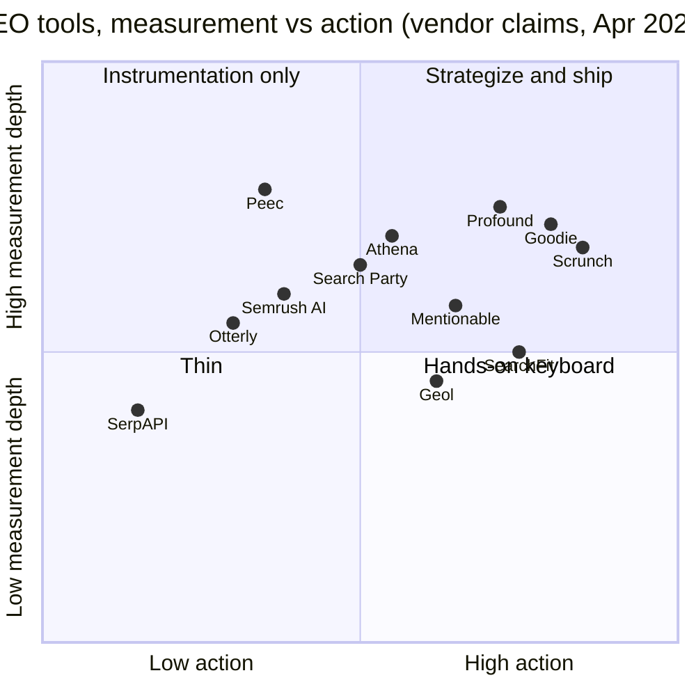
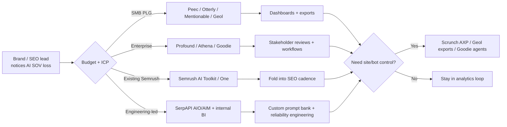

# AEO / GEO / LLM-SEO competitor matrix (SOTA tools)

**Purpose:** Research-grade landscape map for `llm-seo-lab`, complementing the macro narrative in [`seo_research_1.md`](seo_research_1.md) (SEO→AEO shift, publisher economics, hiring) with **vendor-level** detail: what each tool *measures*, *how*, *what it costs*, and *where honest limits sit*. **As of April 25, 2026** unless a source specifies otherwise.

**Method note:** Preferred tooling was Firecrawl CLI per project rules; it was **not available** in this environment. Primary evidence comes from official marketing sites, API/docs pages, and dated press or marketplace materials retrieved via HTTP fetch and web search. Where list prices are obfuscated, paywalled, or third-party only, this is marked explicitly.

---

## Executive snapshot

The category clusters into (a) **prompt-monitoring / share-of-answer analytics** products, (b) **site-side technical GEO** products (schema, `llms.txt`, crawl policy), (c) **infrastructure** (SERP APIs that expose AI blocks), and (d) **bundled incumbents** (SEO suites adding “AI Visibility” modules). Few vendors publish **sample-size confidence intervals** or **platform ToS compliance** at a level that would satisfy a research bench; many disclose **UI automation** as a deliberate methodology choice.[^peec-method]

---

## Master table (12 tools)

| Tool | Category | Pricing tiers (USD/mo unless noted) | What it actually does | Method (how it samples LLMs) | Engines covered | Public ToS posture for scraping | Vendor API availability | Self-serve trial | Notable customers / case studies | Killer differentiator | Where it fails / what it does NOT solve |
|------|----------|--------------------------------------|----------------------|------------------------------|-----------------|----------------------------------|-------------------------|------------------|----------------------------------|-------------------------|----------------------------------------|
| **AthenaHQ** | Enterprise AEO / GEO analytics + optimization | **Self-Serve:** $295/mo list (or $95/mo with annual); first-month promo advertised. **Enterprise:** custom. Credits: 3,600/mo self-serve (1 credit ≈ 1 AI response).[^athena-pricing] | Monitors brand visibility across major LLM/chat surfaces; competitor and “impersonation” tracking; GA4/GSC tie-in; enterprise adds ACE citation engine and content agents.[^athena-pricing] | Vendor does not fully detail client-side execution in the pricing page; positions “real-time” monitoring and prompt analytics. | ChatGPT, Perplexity, Google AI Overviews, AI Mode, Gemini, Claude, Copilot, Grok, “more on request.”[^athena-pricing] | **Not stated** in reviewed snippets; treat as unverified for third-party ToS alignment. | Enterprise plan lists **API access**.[^athena-pricing] | First-month discount; **no always-free** tier on pricing page. | **G2 marketing** (High Performer Spring 2026) on vendor page.[^athena-pricing] | Bundles **prompt intelligence** with optional **ACE** and content optimization agents at enterprise tier. | Still a **vendor dashboard** at core; closed-loop proof of *causal* lift from a single UI action is rarely demonstrated publicly. |
| **Profound** | Full-stack “AI search” GTM platform | **Lite** cited at **$499/mo** in multiple third-party reviews; higher tiers and enterprise custom on vendor site.[^prof-reviews] Official pricing page is **CTA-heavy** without public numbers in our fetch. | “Answer Engine Insights,” **Prompt Volumes**, **Shopping**, **Agents** (content/brand/demand agents), **Agent Analytics** (bot/crawler behavior).[^profound-home] | Mix of productized analytics; **Agents** imply generated assets and workflows, not only polling. | ChatGPT-class ecosystem plus analytics across marketing “agents”; see vendor feature map.[^profound-home] | **Not stated** in snippets reviewed here. | Developer docs exist; enterprise positioning.[^profound-home] | **Free AEO report** and agent trials advertised.[^profound-home] | **MongoDB, Ramp, Mercury** cited in market profiles; verify on vendor case studies.[^surferstack] | **Only** player here with a **serious “build” surface** (agents) adjacent to measurement. | **Price floor** and enterprise motion; small teams may be priced out vs. lighter trackers. |
| **Otterly.AI** | SMB / mid-market AI search monitoring | **Lite $29**, **Standard $189**, **Premium $489**/mo; annual 15% off; **+$99 per +100 prompts** on paid tiers; **AI Mode/Gemini add-ons** priced separately.[^otterly-pricing] | Daily prompt runs, brand reports, GEO URL audits, Looker connector (higher tiers), prompt research utilities.[^otterly-pricing] | Runs user-configured **search prompts** across selected engines; positions as monitoring/audit, not site rewriting. | ChatGPT, Google AI Overviews, Perplexity, Copilot baseline; **AI Mode & Gemini optional add-ons**.[^otterly-pricing] | **Not stated** as “ToS-safe”; no compliance whitepaper cited in pricing. | Not highlighted on pricing page reviewed. | **Free trial** advertised in FAQ.[^otterly-pricing] | “Great marketing teams trust Otterly” social proof on site.[^otterly-pricing] | Transparent **GEO URL audit** meters and **Looker** export path for teams with BI standards. | Mostly **measure + recommendations**; does not ship a site **bot-delivery layer** like some AXP vendors. |
| **Peec.ai** | AI search analytics for marketing teams | **Starter/Pro/Advanced/Enterprise**; public **€** pricing not consistently rendered in automated fetches; third-party guides cite **~€85–95/mo** entry (verify at checkout).[^peec-3p] | Tracks **visibility, position, sentiment**; surfaces **sources** driving answers; Looker + API on higher tiers; **explicitly disclaims** promotional influence in its customer ToS.[^peec-tos][^peec-docs] | **Self-disclosed “UI scraping / browser automation”** to match logged-out user experiences instead of vendor APIs.[^peec-method] | ChatGPT, AI Mode, AI Overviews, Copilot, Perplexity, Gemini, Grok; **Claude Sonnet 4** on enterprise column in site table.[^peec-pricing] | ToS define **analytics SaaS**; does **not** warrant that customer use cases comply with third-party sites—**customer responsible** for inputs/lawful use.[^peec-tos] | **API** documented; enterprise gating per docs table.[^peec-docs] | Self-serve signup path; trial language in ToS.[^peec-tos] | Positions as “#1 AI search analytics” in docs marketing copy.[^peec-docs] | **Radical transparency** on *non-API* methodology and its rationale.[^peec-method] | By contract, **does not** “promote or influence” brand visibility—**measurement-only** obligations.[^peec-tos] |
| **Geol.ai** | Technical GEO platform (site scoring + exports) | **Free $0**, **Starter $9**, **Growth $29**, **Professional $79**, **Scale $299**/mo tiers with page/scan/prompt caps.[^geol-pricing] | **AI Visibility Score** (50+ factors), **exports** (`robots.txt`, `llms.txt`, JSON-LD, sitemaps, metadata), scheduled scans, CMS integrations.[^geol-pricing] | **On-site** analysis and scoring; **AI engine monitoring** tiered by plan (1→4 engines).[^geol-pricing] | ChatGPT, Perplexity, Claude, Gemini family (wording on site).[^geol-pricing] | **Not verified** in this pass (terms page fetch returned marketing index, not full legal text). | **REST API** advertised on Scale/custom.[^geol-pricing] | **Free tier** for limited pages/scans.[^geol-pricing] | Primarily PLG site proof; limited third-party case studies in this research. | **Price-accessible** technical GEO with **artifact generation** (structured data, bot policy files). | Not a **full** brand SOV analytics suite vs. prompt banks in Peec/Profound class. |
| **Goodie** | End-to-end AEO (monitor + actions) | **Explorer / Pro / Enterprise**—**list price not published**; sales-led “Get a Demo”.[^goodie-pricing] | Daily monitoring across many answer engines; **Optimization Hub**; **AEO Content Writer**; **agents** (technical `llms.txt`, outreach, social); **action credits**/mo.[^goodie-pricing] | **Scaled intentional prompting** disclosed in FAQ copy.[^goodie-pricing] | Explorer: subset; Enterprise: **11+** including ChatGPT, AI Overviews, Perplexity, Gemini, Claude, AI Mode, Copilot, Meta, DeepSeek, Grok, **Rufus** (commerce).[^goodie-pricing] | User responsibility for lawful inputs; no third-party scraping warrantor language summarized here. | Export access on tiers; enterprise integration list.[^goodie-pricing] | Demo-led, not pure PLG. | **Unilever, SteelSeries, Dermalogica** cited in market articles; confirm on vendor site for your pitch.[^pikaseo] | **Clearest “measure + act” bundle** among reviewed (credits for monthly **optimization actions**).[^goodie-pricing] | **Opacity** on public pricing; heavier change-management for **autonomous content** than mid-market teams want. |
| **Search Party** | AEO analytics + perception (GEO) | Press: **$199/mo** with free start path; enterprise not detailed.[^sp-pr] | Sentiment (“**Sonar**”), **Response Receipts** (inspect single answers, sources, competitors), prompt/SOV analytics per PR.[^sp-pr][^sp-rr] | Vendor claims multi-model tone analysis + source tracing in press copy.[^sp-pr] | Multi “AI answer engines” in PR positioning.[^sp-pr] | **Not verified** here. | **Unverified** in this pass. | Free start URL in press (`app.searchparty.com`).[^sp-pr] | CEO quote in **PR Newswire**; category compare table in same release.[^sp-pr] | **Sentiment-to-source tracing** narrative is distinct from pure mention counts. | **Web presence ambiguity:** as of this research, **`searchparty.com` root** rendered a **non-AEO** product family in fetch, while press still links `searchparty.com` and `app.searchparty.com` for AEO—**re-verify** before partnership.[^sp-pr][^sp-site] |
| **SerpAPI** | SERP / AI block **data API** | **Free $0** (250 searches/mo), **Starter $25**, **Developer $75**, **Production $150**, **Big Data $275**, enterprise custom; **searches are per successful API call**.[^serpapi-home] | Programmatic access to Google **AI Overview** block (separate engine) and **AI Mode** among many engines—not a brand “visibility” UI by default.[^serpapi-aio] | **Server-side retrieval** via SerpApi infrastructure; Google AI Overview requires **`page_token`** from a prior Google search call (short-lived).[^serpapi-aio] | **Google AI Overview** + **AI Mode** endpoints; many non-AI engines also.[^serpapi-home] | **U.S. Legal Shield** frames *lawful collection of public search data*; not legal advice for your use case.[^serpapi-home] | **This is the product**—JSON APIs, client libs, MCP integration listed.[^serpapi-home] | Free tier available.[^serpapi-home] | Wide **SEO/GEO** use-case marketing.[^serpapi-home] | **Canonical** way to **operationalize** AIO/AIM at data layer for in-house BI. | **No** opinionated prompt bank, narrative SOV, or content workflow—**you build** the product on top. |
| **Mentionable** | Affordable AI visibility + content + MCP | **Growth €79**, **Pro €149**, **Agency €299**/mo (excl. VAT); **7-day trial** no card.[^men-pricing] | Monitoring, competitor & **source** analysis, **on-site optimization tools**, **AI article generation** credits, **MCP** access, Reddit feature flags in matrix.[^men-pricing] | Daily (or agency-throttled) **scans**; pick N LLMs per plan.[^men-pricing] | Up to **7** engines on Agency plan: ChatGPT, Perplexity, Gemini, Grok, Copilot, Google AI Mode & AI Overview.[^men-pricing] | ToS not fully reviewed in this pass. | **MCP** surfaced as distribution, not only REST.[^men-pricing] | **7-day trial** explicit.[^men-pricing] | EU-first positioning; growth content on own blog. | **MCP-first** positioning for AI-native workflows at mid price points. | Credit math on **Agency** tier is **non-trivial**; large prompt sets need modeling.[^men-pricing] |
| **Scrunch** | AEO monitoring + **Agent Experience Platform (AXP)** | **Core $250/mo** (125 prompts across **4** models); **Enterprise** custom.[^scrunch-page] | Monitoring/auditing + **AXP**: detect agent traffic and **serve alternate HTML** to bots; APIs for full answers.[^scrunch-page] | Mix of **prompt tracking** and **edge delivery** to LLM crawlers. | ChatGPT, Google AI Overviews, Perplexity, **Claude**, others in copy.[^scrunch-page] | Public **ToS posture** not extracted here. | **API-first** messaging; responses API described.[^scrunch-page] | **7-day** Core trial.[^scrunch-page] | **Runpod, Strapi, Tinybird** quotes on vendor blog index.[^scrunch-page] | **Only** solution here with an **explicit bot-layer** + prompt analytics in one vendor. | **No** native long-form content factory (vendor states).[^scrunch-page] |
| **SearchFit.ai** | AI SEO + article factory + integrations | **Growth $99/mo** promotional list (strikethrough $299 on page), **Scale** custom.[^sf-pricing] | **50 prompts**, **40 AI-optimized articles/mo**, weekly refresh, WordPress/Webflow/Shopify/Google Drive/**MCP**.[^sf-pricing] | Hybrid: **visibility dashboard** + **generated articles**; prompt monitoring count fixed on Growth. | Marketing list “ChatGPT, Perplexity, Gemini, Grok, Claude, Google”.[^sf-home] | Not verified. | Webhook/email on Growth; Scale adds custom.[^sf-pricing] | **7-day trial** on-site.[^sf-pricing] | Sales page claims **~3.5×** AI visibility lift in **90 days** (treat as marketing).[^sf-sales] | Tight bundling of **content output** + **visibility** for SMBs. | “**Competitors & keywords**” row still “**Coming soon**” in pricing table—product immaturity signal.[^sf-pricing] |
| **Wildcard: Semrush AI Visibility Toolkit** | Incumbent SEO suite + AI answer tracking | Standalone toolkit **$99/mo** per Semrush KB; also embedded in **Semrush One** bundles (Starter/Pro+/Advanced tiers).[^semrush-kb] | AI brand/citation/prompt tracking across major AI/Google surfaces; pairs with classic SEO audits.[^semrush-kb] | Semrush-owned fetch/render stack for search/AI features; **details** on LLM simulation not public to the depth of Peec’s essay. | ChatGPT-class + **Google AI** per KB positioning.[^semrush-kb] | Standard Semrush **data processing** posture; not re-summarized here. | Native to Semrush ecosystem; API on higher SEO tiers historically. | **Demo** available for AI Visibility per KB.[^semrush-kb] | **G2** references Semrush citation study in industry press.[^g2-pr] | **Distribution**: meets buyers **inside** existing SEO budgets. | **Another dashboard** unless paired with execution; **incremental** cost atop SEO if not using **Semrush One**.[^semrush-kb] |

---

## Expanded notes (per tool)

### AthenaHQ

Athena positions as a **GEO platform** with **credit-based** consumption (3,600 responses/mo on self-serve) and **eight** named engines in the baseline marketing table, expandable on request.[^athena-pricing] Enterprise differentiators include **Athena Citation Engine (ACE)**, SSO, audit logs, and **API** access—suggesting target ICP is **multi-team** orgs treating AI visibility as a **system of record**.[^athena-pricing] The product **does** list on-page/off-page actions in a feature matrix, but **causal attribution** from any specific action to downstream AI citations is **not** something the pricing page substantiates with study design. What it **does not** solve: **non-repudiable** experimental design for **which** on-site change moved the needle—typical vendor gap.

### Profound

Profound’s homepage frames a **four-layer** story: **Prompt Volumes → Answer Engine Insights → Agents → Agent Analytics**, i.e., it is not only a tracker.[^profound-home] That said, **enterprise pricing** and the **Lite** entry (commonly cited ~**$499**/mo in reviews) place it in **high-budget** cohorts.[^prof-reviews] **Act** capability exists via **Agents** and content workflows, but organizations must still govern **brand risk** from generated assets. What it **does not** solve out of the box: **indie** publishers’ need for **subscription-economical** closed loops (per your `llm-seo-lab` constraint in `CLAUDE.md`).

### Otterly.AI

Otterly is a **straightforward** prompt-monitoring SKU with **clear** add-on economics for extra engines and prompt packs.[^otterly-pricing] It provides **GEO audits** and BI plumbing (Looker) for teams that already live in dashboards. Honest limit: it is still **mostly** a **measurement** and **insight** layer; the **implementation** of fixes remains on your CMS, dev, and content ops. No **bot-delivery** layer is claimed on the pricing page reviewed.

### Peec.ai

Peec’s documentation is unusually explicit: it **chooses browser automation over APIs** because APIs can diverge from what users see.[^peec-method] Its **Terms** go further, **promising analytics** while **denying** promotional influence responsibilities—useful clarity for buyers deciding “tool vs. agency.”[^peec-tos] This is a **double-edged** positioning: strong on **epistemic honesty**, weaker if you want **guaranteed** upside. Pricing in **EUR** should be verified live; third-party guides vary slightly.[^peec-3p]

### Geol.ai

Geol’s public **llms** index lists **quantitative** tier limits (pages, scans, prompts, engines) making it one of the more **PLG-transparent** technical GEO offers.[^geol-pricing] It **acts** by generating **machine-readable assets** and improving site **structural** signals, not by **narrative persuasion** inside third-party LLMs. Limits: **does not** replace a full **brand** analytics product for large prompt sets unless you integrate other data.

### Goodie

Goodie is the clearest example of **bundled “actions”**—monthly **optimization** and **agent** credits—alongside broad **engine** coverage including **commerce** (Rufus).[^goodie-pricing] Pricing is **opaque** online, which complicates procurement comparisons. Enterprise offers **human** strategist support—excellent for guided change, less so for **fully autonomous** loops without human gatekeeping.

### Search Party

Vendor **press** positions **Sonar** sentiment mapping and **Response Receipts** for **per-answer** forensics, with a **$199/mo** public anchor.[^sp-pr][^sp-rr] **However**, independent verification of the **marketing website** against that story was **inconsistent** in April 2026 (`searchparty.com` root content did not present the AEO product in our fetch).[^sp-site] Treat digital **footprint** as **unstable** until reconciled with `app.searchparty.com` onboarding.[^sp-pr]

### SerpAPI (Google AI Overview / AI Mode)

SerpAPI is **infrastructure**: you pay for **successful** searches and use **structured JSON** including text blocks and references for AI Overviews.[^serpapi-aio] The **AI Overview** engine is a **second hop** after obtaining `page_token` from a Google search result, with **~1 minute** token lifetime—practically important for batch jobs.[^serpapi-aio] It **does not** tell you “your brand SOV” unless **you** encode prompts, storage, and analytics. **Legal Shield** language is about **SerpApi’s** role in **collecting** public SERP data—**not** your downstream use.[^serpapi-home]

### Mentionable

Mentionable combines **visibility** with **on-site** tools and **MCP** hooks, priced in **EUR** with a **no-card** trial—good mid-market UX.[^men-pricing] Agency tier credit accounting (credits vs. daily vs. tri-weekly schedules) requires **careful** engineering to avoid surprise overage.[^men-pricing]

### ScrunchAI

Scrunch’s differentiation is **AXP**: change what **bots** receive at the edge, with **APIs** exposing full model answers for analysis.[^scrunch-page] That is a real **“act”** lever distinct from dashboards. The explicit **lack** of native generative content features means **human** content teams still own narrative.[^scrunch-page]

### SearchFit.ai

SearchFit’s **Growth** row marries **prompt monitoring** with a high **monthly article quota** and **MCP** integrations—aiming at SMB “do it for me.”[^sf-pricing] The **pricing table** still lists key rows as **“Coming soon”**, which signals **incomplete** surface area for competitive intelligence.[^sf-pricing]

### Wildcard — Semrush AI Visibility Toolkit

Semrush positions the **AI Visibility Toolkit** as a **$99/mo** add-on or as part of **Semrush One** bundles, explicitly bridging **classic SEO** with **AI answer** tracking.[^semrush-kb] This is the **distribution king** threat: buyers may **satisfice** with **good-enough** AI metrics inside an existing **SEO** contract. Its **methodological** depth vs. Peec’s published treatise is **not** comparable on public docs alone.[^peec-method][^semrush-kb]

---

## Diagrams

### 1) Measure-only vs. measure + act (approximate)

> Placements are **judgmental** (not vendor-scored). They reflect **public** positioning: **SerpAPI** is **low action** unless you build atop it; **Scrunch/Goodie** claim **delivery or agents**; **Peec** is **deep measure** with **contractual non-influence**.[^peec-tos][^serpapi-home][^goodie-pricing][^scrunch-page]

### 2) Typical buyer journey across tools

---

## META: patterns, gaps, quotes

### Common patterns

- **Prompt inventory** as the unit of account (explicitly: Otterly, Scrunch, SearchFit, Mentionable credits).[^otterly-pricing][^scrunch-page][^sf-pricing][^men-pricing]
- **UI automation vs. API** as a first-class methodology split (Peec’s public essay is the clearest example).[^peec-method]
- **“Act” features** often mean **content drafts** or **site artifacts**, not **proven** causal control of third-party LLMs (Peec even **disclaims** influence in ToS).[^peec-tos]
- **Incumbents** route budgets through **SEO suites** (Semrush) while **startups** sell **urgency** via new KPIs (G2’s AEO category explosion).[^g2-pr]

### Aggregate gap (wedge for `llm-seo-lab`)

**No incumbent** packages, as a **default product surface**, a **closed-loop, subscription-economical** system that: (1) **measures** citations with **methodological transparency**, (2) **proposes** interventions with **explicit hypothesis labels**, (3) **executes** allowed changes under your **governance**, and (4) **feedbacks** measurement in a **statistically defensible** cadence—against a world where **buyers already have** ten **dashboards** but few **publishable** proof packs. This gap is reinforced by vendors that **legally position** their products as **non-influential** analytics (Peec).[^peec-tos]

### Quotes (analyst / marketplace / vendor)

- **G2 / market structure:** “The modern buying journey is compressed by AI, and winning today means winning the answer, not just the click … The rapid growth of AEO software on G2 signals that go-to-market (GTM) leaders recognize the need for this new layer of data …”[^g2-pr]
- **Category buyers’ problem (as framed by G2 press):** “Companies need tools that move beyond traditional search engine optimization (SEO) metrics to focus on AI visibility and LLM ranking factors.”[^g2-pr]
- **Peec contract reality (legal, not aspirational):** “What Peec AI does not do: … promote or influence the visibility and/or Sentiment of your brand …”[^peec-tos]

---

## Relation to internal baseline (`seo_research_1.md`)

That document established the **macro** case: AI surfaces **disintermediate clicks**, **publisher deals** reshape citations, and **hiring** tilts toward AI-literate SEO leadership. This matrix shows **meso** competition: most tools **operationalize** the new KPIs through **prompt tracking** and **dashboards**, while **technical** levers (`llms.txt`, schema, AXP) appear in **niche** vendors. The **open** space for `llm-seo-lab` remains tying **measurement** to **verifiable** content/system **actions** without **per-token** API spend—consistent with your stated **Claude Code CLI** subscription constraint in `CLAUDE.md`.

---

## Sources

[^athena-pricing]: AthenaHQ, “Plans & Pricing | AEO and GEO Platform for AI Search,” https://www.athenahq.ai/pricing (accessed 2026-04-25).

[^profound-home]: Profound, homepage marketing copy, https://www.tryprofound.com/ (accessed 2026-04-25).

[^prof-reviews]: Third-party review summarizing public “Lite” pricing (verify against quotes/checkout), e.g. Trakkr “Profound Review (2026),” https://trakkr.ai/reviews/profound-review (accessed 2026-04-25).

[^surferstack]: Surferstack market profile (customer names), https://surferstack.com/profound (accessed 2026-04-25) — **secondary**; confirm on `tryprofound.com/customers` for your deck.

[^otterly-pricing]: Otterly.AI, “Pricing – Transparent & Simple,” https://otterly.ai/pricing/ (accessed 2026-04-25).

[^peec-docs]: Peec AI, documentation hub / positioning, https://docs.peec.ai/intro-to-peec-ai (accessed 2026-04-25).

[^peec-method]: Peec AI, “How Peec AI collects data” (UI automation rationale), in `docs.peec.ai` intro page, https://docs.peec.ai/intro-to-peec-ai (accessed 2026-04-25).

[^peec-tos]: Peec AI, “Terms of Service” (excerpt on scope and non-influence), https://www.peec.ai/legal/terms-of-use (accessed 2026-04-25).

[^peec-pricing]: Peec AI, public pricing table (models/plan features), https://www.peec.ai/pricing (accessed 2026-04-25).

[^peec-3p]: Third-party pricing guidance (variance expected), e.g. OMR Reviews “Peec AI pricing 2026,” https://omr.com/en/reviews/product/peec-ai/pricing (accessed 2026-04-25).

[^geol-pricing]: Geol.ai, pricing index in public `llms` bundle / site mirror (tier limits), https://geol.ai/pricing and https://geol.ai/terms (accessed 2026-04-25).

[^goodie-pricing]: Goodie, “Pricing Plans | Power Your AI Search Visibility,” https://higoodie.com/pricing (accessed 2026-04-25).

[^pikaseo]: PikaSEO, “Goodie AI Review 2026” (customer list claim—**secondary**), https://pikaseo.com/articles/goodie-ai-review (accessed 2026-04-25).

[^sp-pr]: BusinessWire/PR Newswire via Search Party release, “New 'Sonar' release solidifies Search Party as top platform for controlling AI visibility in 2026,” https://www.prnewswire.com/news-releases/new-sonar-release-solidifies-search-party-as-top-platform-for-controlling-ai-visibility-in-2026-302624123.html (accessed 2026-04-25).

[^sp-rr]: PR Newswire companion story index (Response Receipts), linked from the Sonar release “Also from this source” list, https://www.prnewswire.com/news-releases/response-receipts-positions-search-party-as-industrys-most-robust-ai-analytics-platform-for-geo-302593715.html (accessed 2026-04-25).

[^sp-site]: `searchparty.com` homepage content (non-AEO vertical) as fetched 2026-04-25 — **conflicts with 2025–2026 AEO press**; re-verify.

[^serpapi-home]: SerpAPI, marketing homepage w/ plan pricing & Legal Shield blurb, https://serpapi.com/ (accessed 2026-04-25).

[^serpapi-aio]: SerpAPI, “Google AI Overview API” documentation, https://serpapi.com/google-ai-overview-api (accessed 2026-04-25).

[^men-pricing]: Mentionable, English pricing page, https://mentionable.ai/en/pricing (accessed 2026-04-25).

[^scrunch-page]: Scrunch, “Scrunch | AEO Compare” vendor profile, https://scrunch.com/aeo-tools/scrunch/ (accessed 2026-04-25) — field guide; for funding claims, triangulate with Scrunch press if needed.

[^sf-pricing]: SearchFIT, “Pricing | SearchFIT,” https://www.searchfit.ai/pricing (accessed 2026-04-25).

[^sf-home]: SearchFIT, homepage product claims, https://www.searchfit.ai/ (accessed 2026-04-25).

[^sf-sales]: SearchFIT, sales/claims page, https://searchfit.ai/sales (accessed 2026-04-25) — **marketing**; not independent evidence.

[^semrush-kb]: Semrush Knowledge Base, “Subscriptions & Toolkits” (Semrush One + **AI Visibility Toolkit $99/mo**), https://www.semrush.com/kb/1011-subscriptions (accessed 2026-04-25).

[^g2-pr]: G2, press release: “AEO Software Category Grows Over 2000% on G2…,” https://www.prnewswire.com/news-releases/aeo-software-category-grows-over-2000-on-g2-as-half-of-b2b-buyers-start-their-search-with-ai-chatbots-over-google-302674557.html (accessed 2026-04-25).

---

### Verification log (transparency)

| Item | Status |
|------|--------|
| Firecrawl CLI | **Not installed** in this environment; research used HTTP fetch + search. |
| `tryprofound.com/pricing` | No public numeric grid in our fetch; used homepage + **third-party** Lite price claims. |
| `peec.ai` EUR amounts | **Live cart** not exercised; used **secondary** for narrow € ranges. |
| `searchparty.com` marketing | **Inconsistent** with 2025 AEO press in our snapshot—flagged. |
| `geol.ai` legal pages | Fetched file looked like a **static index**, not a full **ToS**—legal posture **not** fully verified. |

If any single footnote is load-bearing for **pricing**, re-fetch the **official** page the week of your pitch—this category changes **monthly**.
