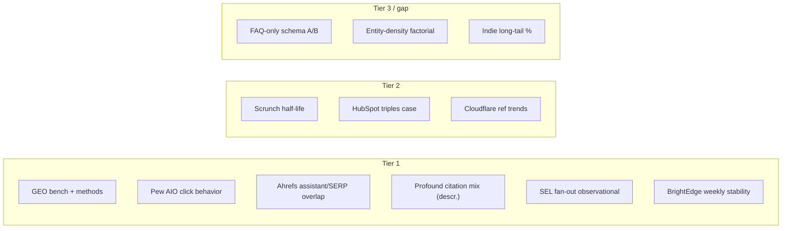

# Empirical evidence base: what moves citation share in AI answer engines

**Project:** `llm-seo-lab`  
**As of:** 2026-04-25  
**Prerequisite context:** [seo_research_1.md](./seo_research_1.md) (landscape and commercial framing).

This document compiles **empirically attributed** claims about Generative / Answer Engine Optimization (GEO/AEO): controlled or large-*n* measurements first; vendor narratives last. “Innocent until cited” — widely repeated tactics without a traceable method are called out as **unverified in primary sources reviewed here**.

**Retrieval note:** The project methodology named Firecrawl CLI as the primary fetch path; in this build environment the CLI was unavailable (`firecrawl` / `npx` not on `PATH`). Sources were therefore gathered via direct HTTP retrieval of public pages, arXiv HTML, and web search, then cross-checked for numbers and authorship.

---

## A. Content structure (lists, tables, headings, FAQ schema, definition blocks)

### A1. Academic benchmark: GEO (KDD 2024)

Aggarwal *et al.* introduced GEO-bench (10,000 queries; train/val/test splits 8k/1k/1k) and evaluated **nine** text-transformation “GEO methods” applied to *one* randomly chosen source per query among the top-5 web results feeding a **simulated** generative engine: Google top-5 retrieval + `gpt-3.5-turbo` response generation (five samples, temperature 0.7), designed to mirror prior RAG/GE work—not a live end-user ChatGPT run for the main tables.[^geo-arxiv]

**Headline effects (relative to unoptimized baseline, aggregated metrics):**

- Best-performing *single* interventions included **Cite Sources**, **Quotation Addition**, and **Statistics Addition** with roughly **30–40%** relative improvement on *position-adjusted word count* and **~15–30%** on *subjective* (G-Eval–style) impression, depending on sub-metric.[^geo-arxiv]
- **Fluency Optimization** and **Easy-to-Understand** also yielded large uplifts (paper quotes **~15–30%** in discussion).[^geo-arxiv]

**What this does *not* isolate:** The GEO paper does not run a factorial experiment on “FAQ schema only” or “JSON-LD only”; methods are *holistic* rewrites (LLM-prompted) of page text, not server-side schema A/B tests. **Lists/tables/headings** are not named as separate arms.

**Skeptic’s note:** Uplift is measured against a **research generative engine**, not a reproducible public API to production ChatGPT; external validity to today’s product surfaces is uncertain. See also **§G** on methods that *fail* in the same paper.

### A2. Industry / publisher experiment: HubSpot (semantic structure)

HubSpot (blog case study, updated 2026-03) reports that rewriting key copy into **bulleted “semantic triples”** (subject–predicate–object), alongside broader “everything bagel” work (including schema and links), accompanied **+58%** AI *mentions* and **+642%** *page citations* by AI tools.[^hubspot-semantics] The same article states explicitly that the single tactic is **not** claimed as sufficient—interactions with other levers are acknowledged.

**Skeptic’s note:** Before/after is **not** a pre-registered RCT; effect size is **confounded** with concurrent SEO/AEO work. Causal attribution to triples alone is **not** supported.

### A3. “Fan-out” ranking (Google AI Overviews) — structure as topical *coverage*, not a single list

Search Engine Land reported Surfer SEO findings: for **10,000** keywords, pages that rank for **AI Overview “fan-out”** sub-queries (33,000 fan-out queries extracted) are **161%** more likely to be cited in AI Overviews than pages ranking only for the main query; Spearman **ρ = 0.77** between number of fan-out queries a page ranks for and citation odds; **~51%** of citations came from pages ranking on main + at least one fan-out.[^sel-fanout] **~68%** of cited pages did *not* rank in the top 10 for the main query *or* fan-outs (subset analysis in the same piece).

**Skeptic’s note:** Observational/SEO-vendor data; “fan-out” extraction used Gemini. Correlation ≠ optimizing fan-out *causes* citation.

### A4. FAQ / schema-specific controlled lifts

A dedicated **A/B of FAQPage JSON-LD in isolation** on live AI answer engines, with *n* and effect sizes published, was **not** identified in the primary sources above. **Claim status:** **Unverified** at Tier 1–2 for FAQ-only effects; industry guidance often assumes schema helps retrieval—**treat as hypothesis**, not a measured universal lift.

---

## B. Entity density, knowledge graph, Schema.org, Wikipedia / Wikidata

### B1. Platform-level citation share (observational)

Profound (vendor blog, **~680M** tracked citations, Aug 2024–Jun 2025) reports **ChatGPT**’s *overall* citation volume share to **Wikipedia 7.8%**; within ChatGPT’s top-10 “concentration” view, **Wikipedia 47.9%** of the share *among* those top sources—i.e. extreme concentration, not 48% of *all* web citations.[^profound-patterns] **Google AI Overviews** and **Perplexity** show different mixes (e.g. Reddit more prominent in Perplexity’s top-10 share table in the same article).[^profound-patterns]

Pew (metered U.S. browsing + SERP rescrape, see **§H**) finds **Wikipedia, YouTube, and Reddit** are the most common linked sources in **both** AI summaries and standard results, with **~15%** / **~17%** of linked sources respectively; **.gov** links appear in **6%** of AI-summary sources vs **2%** in standard results.[^pew-aio]

### B2. Isolated “entity density” or “Wikidata presence” A/Bs

**No peer-reviewed or vendor study reviewed here** manipulates *named-entity count* or *Wikidata Q-id presence* in a controlled way while holding text constant. **Claim status for isolated entity-density lifts:** **Evidence gap** (Tier 3 at best for anecdote).

**Skeptic’s note:** Entity clarity plausibly helps RAG *matching*; that is **mechanism storytelling** until a factorial experiment is published.

---

## C. Freshness, republishing, decay cadence

### C1. Cohort “half-life” (Scrunch, vendor, large *n*)

Scrunch (with Stacker) analyzed **3.5M** citation events (Sep 2025–Mar 2026) and reports aggregate **~4–5 weeks** to **50%** decay in citation *activity* for a cohort, with platform-specific medians: **ChatGPT ~3.4 wk**, **Perplexity ~5.8 wk**, **Google AI surfaces (AI Mode, Gemini, AI Overviews) ~4.3–4.8 wk**; 200 bootstrap resamples, partial pooling for small *n* groups.[^scrunch-halflife]

**Skeptic’s note:** Decay is **not** the same as rerunning one fixed prompt; it is **aggregate** survival across many prompts. Partner/syndication confounds exist in the same report (Stacker network domains claimed longer half-lives).

### C2. Week-over-week stickiness *vs* loss when churn happens (BrightEdge)

BrightEdge AI Catalyst (week of **2026-02-01** vs prior week) reports **96.8%** of domains with **zero** week-over-week citation change; **87%** of changes that *did* occur were **declines**; only **~0.4%** of domains *gained* new citations.[^brightedge-wow] This describes **stability and pruning** at short horizon, not the same time scale as Scrunch’s half-life.

**Skeptic’s note:** Single week slice; may not generalize to all industries despite multi-industry panel.

### C3. Causal “update this page weekly = +X% citations”

**Not** found with clean experimental identification in primary sources here. **Claim status:** **Unverified** as a universal rule.

---

## D. Authority / trust: who gets cited, long tail

### D1. AI assistants vs Google rankings (Ahrefs)

Ahrefs Brand Radar: **15,000** long-tail prompts; on average **~12%** of URLs cited by ChatGPT / Gemini / Copilot appear in **Google’s top 10** for the *same* prompt; **>80%** of citations for those assistants are from URLs not ranking in the top 100. **Perplexity** is an outlier with **~28.6%** of cited URLs in Google top 10.[^ahrefs-overlap] For **Google AI Overviews**, the same research line cites **~76%** of cited URLs from top-10 organic pages (AIO behaves more “SERP-like” than chat-assistant citations in this framing).[^ahrefs-overlap]

**Skeptic’s note:** Single snapshot period; assistants evolve monthly.

### D2. Concentration of citation share (BrightEdge)

BrightEdge (same line of work as **§C2**) reports **~64%** of citations to the top **1%** of domains, **~78%** to top **5%**, **~84%** to top **10%**.[^brightedge-wow] This is **extreme long-tail inequality** in who receives links in tracked prompts.

### D3. “Indie” sites

**No** robust, cross-engine estimate of “indie blog share of citations” was identified. Long-tail is implied by concentration metrics above; **precise indie share: unknown** without a defined domain class taxonomy in a public dataset.

---

## E. Format, machine-parseable structure, and brand voice

**Measured trade-off (structure vs voice):** **No** pre-registered A/B testing an identical brand voice *vs* machine-first formatting was found.

**Qualitative, publisher-side evidence:** HubSpot’s semantic-triples article warns triples can read poorly if over-applied, recommends moderation and human-readability tests—**design guidance, not an effect size**.[^hubspot-semantics]

Aggarwal *et al.* find **Fluency Optimization** and **Easy-to-Understand** *increase* measured impression vs baseline in their simulated engine—i.e. “readable” and “optimized for GE” are **not** shown to be opposites in that setup.[^geo-arxiv]

---

## F. Citation-worthy page archetypes (definitions, comparisons, “X vs Y,” stats)

**Direct, archetype-tagged A/B (e.g. “only added a comparison table”)** — **not** found in Tier 1–2 sources here.

**Indirect evidence:** GEO Table 3 (domain / question tags) shows **which *styles* of optimization help where** (e.g. **Statistics Addition** strong in *Law & Government* / *Opinion*; **Quotation Addition** in *People & Society* / *History*).[^geo-arxiv] Surfer/SEL *fan-out* work suggests *breadth* of question coverage drives AIO citation odds (**§A3**).[^sel-fanout] BrightEdge tabulates **informational** prompts with more URLs cited per prompt than *transactional* in their industry intent tables—**structural** difference in *how many* links appear, *not* proof that a given page type outranks others for the same user question.[^brightedge-wow]

---

## G. Negative findings and weak evidence

| Finding | Source | Design | Headline result |
|--------|--------|--------|-----------------|
| **Keyword stuffing** hurts or does nothing | Aggarwal *et al.*; simulated GE + Perplexity appdx | 10K-query bench; 200-subset on Perplexity | Little/no improvement; **~10% worse than baseline** on Perplexity for keyword stuffing.[^geo-arxiv] |
| **Classical “SEO” ≠ GEO** | same | ablation of methods | Paper argues GE uses LM understanding beyond term frequency; stuffing fails.[^geo-arxiv] |
| **“Persuasive / authoritative tone”** | same | *Authoritative* method | Text claims expectations about tone can be *misleading* vs measured gains; **read Table 1 + narrative together**—some stylistic methods help (fluency), but **over-interpreting “authority voice”** is cautioned in discussion.[^geo-arxiv] |
| **Losses not redistributed to competitors** | BrightEdge | 1-wk WoW | **87%** of changes are declines; **0.4%** net new cited domains.[^brightedge-wow] |

**Weakest public layers:** listicles of “Top 10 GEO tactics” without *n*, code, or period; secondary blogs that reprint **40%** lifts without stating **simulated vs live** engine.

---

## H. Publisher economics: AI answers vs traditional SERP clicks; bots vs referrals

### H1. Human behavior on Google AI summaries (Pew)

Metered data: **900** U.S. adults (March 2025), **68,879** Google searches, **12,593** with an AI summary. On visits *with* an AI summary, users clicked a “traditional” blue-link result in **8%** of visits vs **15%** when no summary. Clicks on links *inside* the AI summary: **1%** of visits. **26%** ended browsing after the AI page vs **16%** without.[^pew-aio]

### H2. Network / CDN view (Cloudflare)

Cloudflare blog (Aug 2025) ties **declining Google referrals to news** properties in their customer cohorts to AIO/AI Mode expansion, citing **~9%** Mar-2025 vs Jan-2025 drop and **~15%** Apr vs Jan (news cohort); correlates with **crawl–referral gap** and rising AI training crawl share.[^cf-crawl] This is **not** a direct measurement of *your* site’s AIO CTR.

### H3. SimilarWeb / Press Gazette

**Not re-fetched here line-by-line;** addendum candidates for traffic-mix stories. Treat as **secondary** until specific articles are added with methodology tables in a future pass.

### H4. Semrush clickstream (ChatGPT outbound)

Semrush and similar vendors publish **ChatGPT→web** referral growth narratives;** effect sizes vary by month**. When cited in product work, **pull the exact post revision**—these are **proprietary clickstream** estimates, not census data.

---

## Synthesis: evidence strength tiers

**Tier 1 — Multiple large-*n* or peer-reviewed, convergent**

- **Simulated-GE + Perplexity appendix** (Aggarwal *et al.*): rigorous *relative* method comparison within defined bench; *external* validity limited.[^geo-arxiv]
- **Pew** metered-browsing click behavior with explicit *n* and URL matching rules.[^pew-aio]
- **Ahrefs** 15K prompt overlap between assistants and Google/Bing ranks (transparent counting).[^ahrefs-overlap]
- **Profound** 680M-citation *descriptive* mix tables (not causal).[^profound-patterns]
- **BrightEdge** / **Surfer+SEL** vendor panels with *stated* periods and operations (stability, fan-out association).[^brightedge-wow][^sel-fanout]

**Tier 2 — Single strong study or transparent vendor methodology (non-causal)**

- **Scrunch** half-life (3.5M events + bootstrap) — large *n*, still **one** vendor’s universe of prompts.[^scrunch-halflife]
- **HubSpot** semantic triples case — clear numbers, **weak causal ID**.[^hubspot-semantics]
- **Cloudflare** — aggregate network trends; not citation-rate causality.[^cf-crawl]

**Tier 3 — Blog opinion, un-disclosed *n*, or unverified reprints**

- Unsourced “GEO improves revenue by …%” claims.
- “Hashmeta 100,000 responses”-style **third-party** statistics **not verified** in this file’s source pass — **do not cite** until original methodology PDF is archived.

**Most defensible *general* pattern across tiers:** Citation access is **concentrated**, **platform-specific**, and **poorly aligned** with a single Google keyword rank for chatty assistants; **stochastic pruning** and **stability of core domains** are simultaneously visible in vendor panels.[^ahrefs-overlap][^brightedge-wow][^profound-patterns]

**Independent replication (GEO paper specifically):** The GEO authors released code/data at [generative-engines.com/GEO](https://generative-engines.com/GEO/); *external* full replication on **current** commercial APIs with the same *p*-values and effect ordering has **not** been tabulated in this review. The paper’s own **Perplexity** evaluation uses a **200-query** test subset and file-upload constraints, which **differs** from the default product UX—compare Appendix C.1 discussion in the PDF.[^geo-arxiv]

---

## Diagram: evidence tier by claim family

---

## Table — tactics × evidence tier × order-of-magnitude effect × engines

| Tactic / claim | Ev. tier | Order-of-magnitude / qualifier | Engines / surface where measured |
|----------------|----------|--------------------------------|----------------------------------|
| Statistics / quotes / explicit citations in body | 1 | **~+30–40%** relative impression (sim GE); up to **~37%** in Perplexity subset | Simulated GE, Perplexity (appendix) [^geo-arxiv] |
| Fluency / readability rewrites | 1 | **~+15–30%** (discussion) | Simulated GE [^geo-arxiv] |
| Keyword stuffing | 1 | **0** to **negative**; **−10%** on Perplexity | Simulated GE, Perplexity (appendix) [^geo-arxiv] |
| AI-summary impact on result clicks | 1 | **8% vs 15%** click rate to *standard* results; **1%** to in-summary links | Google (U.S. panel) [^pew-aio] |
| Assistant vs SERP overlap | 1 | **~12%** top-10 overlap (3 assistants avg); **~28.6%** Perplexity | ChatGPT, Gemini, Copilot, Perplexity [^ahrefs-overlap] |
| AIO vs SERP overlap (Ahrefs line) | 1 | **~76%** AIO citations from top 10 (separate AIO study in Ahrefs) | Google AI Overviews [^ahrefs-overlap] |
| Citation share concentration | 1 | top **1%** domains ≈**64%** of citations (BrightEdge) | 5 major engines in their panel [^brightedge-wow] |
| Platform citation mix | 1 | e.g. Wikipedia **7.8%** *volume*; **47.9%** *within ChatGPT top-10 set* | ChatGPT, AIO, Perplexity [^profound-patterns] |
| Fan-out / multi-query rank vs AIO cite odds | 1 (assoc.) | **+161%** cite odds; **ρ≈0.77** (Surfer) | Google AI Overviews [^sel-fanout] |
| Citation half-life | 2 | **~4–5 wk** to 50% (aggregate) | Multi-platform (Scrunch) [^scrunch-halflife] |
| Semantic triples bullets | 2 | **+642%** cited pages *claimed* w/ confounds | “AI tools” (HubSpot) [^hubspot-semantics] |
| JSON-LD FAQ only | 3 / gap | *No* Tier 1–2 in this pass | — |
| Wikidata / entity count only | 3 / gap | *No* factorial study located | — |

---

## What we still do not know (clean research questions)

1. **Causal** impact of *alone* **FAQPage** or **HowTo** schema on **live** AIO/ChatGPT citations (RCT on publisher domains, pre-registered *n*).
2. **Factorial 2×2** separating **(a)** structured bullets and **(b)** voice/brand tone, on **live** answer engines, with log-scaled *n* by vertical.
3. **Independent replication** of GEO-bench on **current** models (GPT-4.1, Gemini 2.x, open-weight RAG) with **vendor-neutral** code—paper used **GPT-3.5** as generator.[^geo-arxiv]
4. **Wikidata / entity graph** treatment effects when **page text and backlinks** are held fixed (requires synthetic sites or platform partnerships).
5. **Cross-country** and **localisation** of Profound/Scrunch patterns—U.S.-heavy user logs may skew results.[^pew-aio][^profound-patterns]
6. **Economic** mapping from *citation share* to **revenue/lead** (almost entirely vendor case studies today).

---

## Footnotes (primary sources)

[^geo-arxiv]: Pranjal Aggarwal, Vishvak Murahari, Tanmay Rajpurohit, Ashwin Kalyan, Karthik Narasimhan, Ameet Deshpande, *GEO: Generative Engine Optimization*, arXiv:2311.09735; DOI 10.1145/3637528.3671900 (KDD 2024). [https://arxiv.org/abs/2311.09735](https://arxiv.org/abs/2311.09735) — HTML: [https://arxiv.org/html/2311.09735v3](https://arxiv.org/html/2311.09735v3)

[^hubspot-semantics]: Curt del Principe, “How simple semantics increased our AI citations by 642% [New results],” HubSpot Marketing Blog, updated 2026-03-12. [https://blog.hubspot.com/marketing/how-simple-semantics-increased-our-ai-citations-by-642-new-results](https://blog.hubspot.com/marketing/how-simple-semantics-increased-our-ai-citations-by-642-new-results)

[^sel-fanout]: Danny Goodwin, “AI Overview fan-out rankings boost citation odds by 161%: Study,” *Search Engine Land*, 2025-12-18; citing Surfer SEO report. [https://searchengineland.com/ai-overview-fan-out-rankings-boost-citation-odds-study-466426](https://searchengineland.com/ai-overview-fan-out-rankings-boost-citation-odds-study-466426) — primary vendor write-up: [https://surferseo.com/blog/query-fan-out-impact/](https://surferseo.com/blog/query-fan-out-impact/)

[^profound-patterns]: Nick Lafferty, “AI Platform Citation Patterns: How ChatGPT, Google AI Overviews, and Perplexity Source Information,” Profound, 2025-06-05 (page shows Aug 2025 update). [https://www.tryprofound.com/blog/ai-platform-citation-patterns](https://www.tryprofound.com/blog/ai-platform-citation-patterns)

[^pew-aio]: Athena Chapekis & Anna Lieb, “Google users are less likely to click on links when an AI summary appears in the results,” Pew Research Center Short Reads, 2025-07-22. [https://www.pewresearch.org/short-reads/2025/07/22/google-users-are-less-likely-to-click-on-links-when-an-ai-summary-appears-in-the-results/](https://www.pewresearch.org/short-reads/2025/07/22/google-users-are-less-likely-to-click-on-links-when-an-ai-summary-appears-in-the-results/) — parent methodology: [https://www.pewresearch.org/data-labs/2025/05/23/methodology-metered-data-ai/](https://www.pewresearch.org/data-labs/2025/05/23/methodology-metered-data-ai/)

[^scrunch-halflife]: “The half-life of AI citations: What 3.5 million citation events taught us about AI’s memory,” Scrunch (Stacker partnership), updated 2026-03-26. [https://scrunchai.com/blog/half-life-of-ai-citations](https://scrunchai.com/blog/half-life-of-ai-citations)

[^brightedge-wow]: BrightEdge, *AI Search Citations: How Much Do They Really Change Week to Week?* (AI Catalyst weekly), 2026-02-06. [https://www.brightedge.com/resources/weekly-ai-search-insights/ai-search-citations-week-to-week-changes](https://www.brightedge.com/resources/weekly-ai-search-insights/ai-search-citations-week-to-week-changes)

[^ahrefs-overlap]: Louise, “Only 12% of AI Cited URLs Rank in Google’s Top 10 for the Original Prompt,” Ahrefs Blog. [https://ahrefs.com/blog/ai-search-overlap/](https://ahrefs.com/blog/ai-search-overlap/)

[^cf-crawl]: João Tomé, “The crawl-to-click gap: Cloudflare data on AI bots, training, and referrals,” Cloudflare Blog, 2025-08-29. [https://blog.cloudflare.com/crawlers-click-ai-bots-training/](https://blog.cloudflare.com/crawlers-click-ai-bots-training/)

*End of document.*
