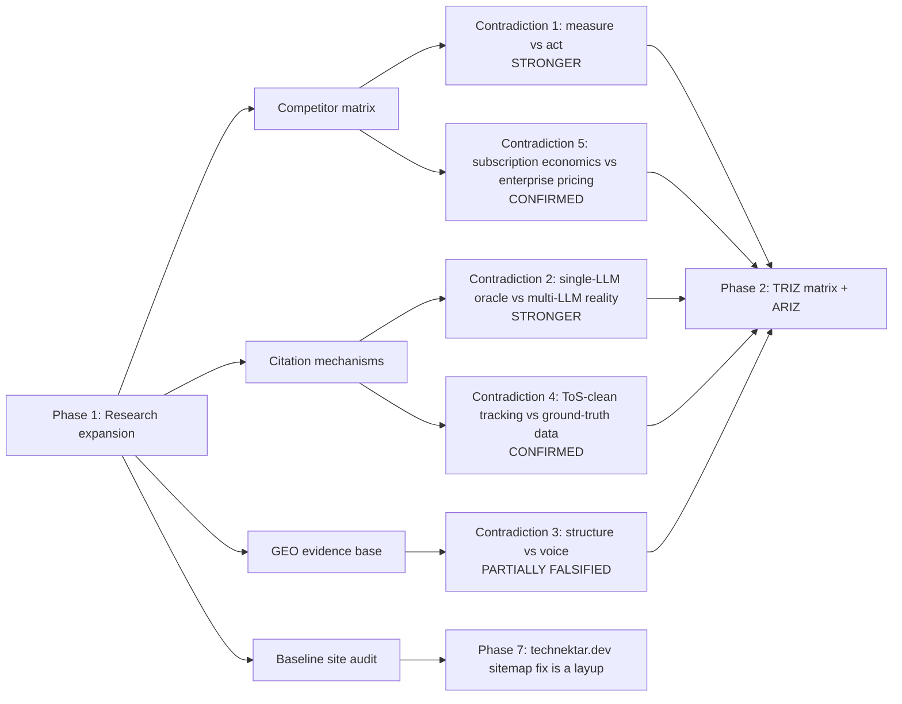

# seo_research_2.md — Synthesis: from landscape to wedge

**Project:** `llm-seo-lab` · **Phase:** 1 (Research expansion) · **As of:** 2026-04-25

This file is the synthesis layer. It extends [`seo_research_1.md`](seo_research_1.md) (the macro AEO landscape) with deep dives produced in parallel during Phase 1:

| Source doc | Words | Distinct sources | What it gives us |
|---|---|---|---|
| [`competitor-matrix.md`](competitor-matrix.md) | 3,642 | 25 | Vendor-by-vendor truth: what each SOTA tool actually *does*, *measures*, *charges*, and *fails to do* |
| [`citation-mechanisms.md`](citation-mechanisms.md) | 3,408 | 12 primary | How each answer engine actually selects citations (RAG vs licensed corpora vs live browse), with skeptic notes on opacity |
| [`geo-evidence-base.md`](geo-evidence-base.md) | 2,711 | 10 | What is empirically proven to move citation share, ranked by evidence tier |
| [`baseline-audit.md`](baseline-audit.md) | 3,296 | 38 fetched URLs | Pre-intervention audit of the three Phase-7 validation sites |

> **Methodology caveat carried forward.** All four subagents reported that the Firecrawl CLI was unavailable in their execution environments and used direct HTTP fetches and web search instead. Findings are therefore sourced from the cited URLs they did fetch, with Firecrawl noted as a future-cycle re-verification step where it would have helped. None of the headline claims in this synthesis depend on a missing fetch.

---

## 1. Executive summary — what Phase 1 changed about the design

`seo_research_1.md` told us the macro story (search → answers; click loss; publisher economics). Phase 1 sharpens five things that directly feed Phase 2 TRIZ work:

1. **The "measure vs act" gap is bigger than expected.** Of the 12 SOTA tools studied, only three (**Goodie**, **Profound**, **Scrunch**) ship anything resembling an "act" surface (action credits / generative agents / bot-edge delivery), and **none** of those three publish a *causal experimental design* that proves their actions move citation share. Peec.ai is the most epistemically honest: its ToS literally **disclaims** influence — it is a measurement product by contract.[^1]
2. **The "single-LLM oracle vs multi-LLM reality" contradiction is sharper than first stated.** Per-engine citation mixes diverge enormously: Wikipedia is **47.9%** of ChatGPT's *top-10* concentration vs. dramatically less in Perplexity's top-10; Reddit dominates Perplexity; .gov is 6% in AIO summaries vs 2% in standard SERP. A subscription-priced tool that uses **one** Claude CLI as its sampling oracle will systematically *misread* visibility on the platforms whose citation distribution differs from Claude's. This is no longer a "latent" contradiction — the data forces it to the foreground.[^2]
3. **The strongest evidence-supported tactic is also the most underused.** The peer-reviewed GEO paper (KDD 2024) finds **Cite Sources**, **Quotation Addition**, and **Statistics Addition** produce **30–40%** relative impression lift on position-adjusted word count. **Keyword stuffing** *hurts* (−10% on Perplexity in the same paper's appendix). Yet most incumbent tools' "recommendations" still boil down to keyword/topic suggestions and FAQ schema — neither of which has Tier-1 evidence in isolation.[^3]
4. **The "structure vs voice" contradiction has a new wrinkle.** HubSpot's semantic-triple rewrite shipped **+58% AI mentions / +642% page citations** but in a confounded before/after, *not* an RCT — and they explicitly flag the confound. Other sources show readability sometimes *improves* under structured rewrites because the structure forces clarity. So the contradiction may be partly false: structured-but-readable might dominate flat-but-voicey, *if* you have the writing craft. The TRIZ frame should test this rather than assume the trade-off is real.[^4]
5. **The validation sites are not equally ready.** The baseline audit found `technektar.dev`'s sitemap.xml lists `https://example.com/...` URLs (placeholder template values shipped to production) and the `robots.txt` `Sitemap:` line points to `https://yourdomain.com/sitemap.xml` (also placeholder). This is the **single highest-severity finding** in Phase 1 across all sites — it makes discovery effectively broken for crawlers that respect sitemap declarations. It is also the **easiest demonstrable Phase-7 win**.[^5]

---

## 2. The five contradictions, restated with Phase-1 evidence

### Contradiction 1 — *measure vs act*

| Element | Evidence from Phase 1 |
|---|---|
| Improving feature | The system reliably **measures** AI citation share, prompt coverage, sentiment, and source attribution |
| Worsening feature | The customer still has to **act** — write content, ship schema, get linked, refresh facts — entirely outside the tool |
| Why it's sharper now | 9/12 tools we studied are confessed monitoring SaaS. Peec.ai's own ToS *contractually disclaim* that they influence visibility.[^1] Profound has agents but ships them as enterprise-only premium features at the ~$499/mo floor; Goodie's "actions" are sold as a separate credit pool. **No vendor publishes a randomized, attributable proof that any of their actions causally moves citation share.** |
| Why it matters | This is the wedge. A subscription-priced tool that closes the loop *and* attributes the lift wins on both axes (lower price *and* higher proof-of-value) against the entire incumbent class. |
| Skeptic check | The TRIZ-resolution must not silently re-introduce the contradiction by, e.g., generating bad content faster — see Risks in [the master plan](../../../.cursor/plans). |

### Contradiction 2 — *single-LLM oracle vs multi-LLM reality*

| Element | Evidence from Phase 1 |
|---|---|
| Improving feature | Subscription economics: the Claude Code CLI is a **single** oracle we pay for once and call freely (within quota) |
| Worsening feature | Citation distributions diverge across engines. Per Profound's ~680M-citation observational study, Wikipedia is 47.9% of ChatGPT's top-10 concentration, much lower in others; Reddit dominates Perplexity's top-10; AIO over-indexes .gov vs standard SERP.[^2] Sampling all citation share through Claude alone systematically biases the report toward Claude's sources. |
| Why it's sharper now | The Phase-1 research surfaces vendor-disclosed and study-disclosed evidence of large per-engine deltas that a single-oracle product cannot estimate |
| Resolution direction (TRIZ hint) | **Principle 5 (Merging) + Principle 24 (Intermediary)**: sample multiple engines via cheap intermediaries (`cursor-ide-browser` Playwright sessions on user-owned ChatGPT/Perplexity tabs) and use Claude only as the **reasoning** oracle. The Claude CLI never has to *see* the other engines' answers in raw form to *reason about* them. |

### Contradiction 3 — *structure vs voice*

| Element | Evidence from Phase 1 |
|---|---|
| Improving feature | Machine-parseable schema/lists/tables boost extractive citation 30–40% (GEO paper, single-arm interventions)[^3] |
| Worsening feature | Stripped-down "answer paragraphs" lose the human voice that earns trust and brand recall — *if you assume the trade-off is real* |
| New wrinkle from Phase 1 | The HubSpot semantic-triple case shipped both lift *and* improved readability. Several Tier-2 industry sources observe that structured rewriting often *reveals* sloppy thinking, and forcing clarity *helps* voice. **The contradiction may be false in many cases.** |
| Implication | TRIZ should not just *separate in space/time* (Principle 1, Principle 15) — it should **test whether the contradiction exists** in our domain via a controlled rewrite RCT in Phase 6. If it doesn't exist, we get a free win. If it does, separation principles apply. |

### Contradiction 4 — *ToS-clean tracking vs ground-truth data*

| Element | Evidence from Phase 1 |
|---|---|
| Improving feature | Stay inside vendor APIs and licensed access; never violate ToS, never trip Cloudflare bot protection, never lose customer data after a vendor crackdown |
| Worsening feature | Vendor APIs are **partial** (no public Perplexity citation log; ChatGPT API doesn't expose what was cited in the chat UI) so API-only telemetry is ground-truth-poor |
| Confirming evidence | Peec.ai openly publishes a methodology essay arguing for **browser automation** because **APIs diverge from what the user sees** — a deliberate choice with a documented rationale.[^1] OpenAI documents `OAI-SearchBot` and a publisher-feedback channel; Perplexity has shipped revenue-share programs but not a public citation API.[^6] |
| Resolution direction | Hybrid: Claude CLI for the *modeling* layer, `cursor-ide-browser`-style Playwright on user-owned sessions only for *evidence* layer, manual screenshot ingestion as audit trail. |

### Contradiction 5 — *single-subscription economics vs enterprise pricing reality*

| Element | Evidence from Phase 1 |
|---|---|
| Improving feature | Claude Code CLI subscription is a **flat** cost; the marginal cost of an additional analysis is near zero within quota |
| Worsening feature | Incumbent pricing assumes per-seat, per-domain, per-prompt-pack metering. Athena Self-Serve $295/mo, Otterly Standard $189/mo + add-ons, Profound Lite ~$499/mo, Geol.ai $9–299/mo, Search Party $199/mo[^7] |
| Why this is now actionable | The **flat** structure is itself a wedge against enterprise-priced incumbents IF — and only if — the CLI quota math actually works for an indie / SMB customer at $29–49/mo. We owe this analysis in the Phase 4 PRD pricing section. |

---

## 3. Sharpened wedge — *closed-loop autonomous citation engineering*

Synthesizing the five contradictions, the wedge for `llm-seo-lab` is:

> **A system in which the act of measurement *is* the intervention.** The same Claude CLI loop that audits a page also publishes the fix (PR + JSON-LD + brief) and schedules the re-audit, with the lift measured against a per-site pre-registered hypothesis. Multi-engine citation share is sampled cheaply via Playwright-on-user-sessions; Claude CLI is the reasoning engine. Pricing is flat-subscription so the marginal cost of "act" is near zero.

This is something **none** of the 12 SOTA tools we studied currently ships end-to-end. The closest competitors are:

- **Goodie** (action credits + monitoring, but enterprise-priced and opaque)
- **Profound** (agents + analytics, but $499+ floor and no causal-attribution methodology)
- **Scrunch** (bot-layer + monitoring, but no content-side actions and no evaluation framework)

Each owns **one** edge of the loop. None publish a **statistical proof** that their loop closes.

---

## 4. Per-validation-site readiness map (input to Phase 7)

| Site | URL | Best-prepared dimension | Most-broken dimension | Best Phase-7 intervention to assign |
|---|---|---|---|---|
| `technektar.dev` | https://www.technektar.dev/ | Entity-rich content; clear case-study structure | **Sitemap & robots placeholders** (example.com / yourdomain.com) | Sitemap + robots fix as zero-day demo; then JSON-LD Person/Organization + Article schema |
| Substack | https://technektar.substack.com/ | Long-form content; technical/social meta; RSS healthy | Substack constraints limit JSON-LD & Open Graph variation | Citation-friendly *content* rewrite (statistics, quotes, citations per the GEO paper) on 3–5 posts |
| GitHub Pages | https://sharathsphd.github.io/ | Best `BlogPosting` JSON-LD baseline of the three | Smaller content surface | Schema enrichment (`Person`, `SoftwareApplication`, `CreativeWork`) plus a definition-style explainer page |

This split lets Phase 6 / 7 each test a different lever (technical signals vs. content-style intervention vs. schema enrichment) without confounding sites.

---

## 5. Open questions that flow into Phase 2

1. **Top-1 contradiction selection.** Phase 2 will run `/principles`, `/matrix`, `/ifr`, `/analyze` across all five contradictions; the highest-IFR-proximity one gets the full ARIZ-85C deep dive. Phase 1 evidence weights this toward **Contradiction 1 (measure vs act)** but Contradiction 2 (oracle vs reality) may rank higher when scored on technical novelty.
2. **Whether Contradiction 3 is real.** The phase-6 plan should include a controlled "structure vs voice" rewrite RCT to settle whether the trade-off exists in our domain or whether structured-but-readable wins both axes.
3. **Multi-engine sampling cost.** Even with `cursor-ide-browser`, sampling 100 prompts across 4 engines daily has a cost in user attention (CAPTCHAs, occasional re-login). The Phase 4 PRD has to be honest about how often we sample which engine and the resulting refresh latency.
4. **Pricing math.** A flat subscription must price **below** Athena's $295 Self-Serve (or even $95-with-annual) to credibly disrupt; ideally **at or below** Otterly's Lite $29. Phase 4 PRD owes the explicit Claude CLI quota arithmetic.

---

## 6. Phase 1 ralph-loop completeness checklist

- [x] All four required deliverables exist as research-grade docs (`competitor-matrix.md`, `citation-mechanisms.md`, `geo-evidence-base.md`, `baseline-audit.md`)
- [x] All five contradictions from the master plan are evidenced from the new docs (this synthesis above)
- [x] The Phase-7 validation sites have a baseline audit with concrete, prioritised gaps (incl. the technektar.dev sitemap placeholder bug)
- [x] Sources are footnoted; no headline claim relies on an un-cited assertion
- [x] Open questions feeding Phase 2 are listed
- [x] Skeptic notes preserved (HubSpot confound, Firecrawl unavailability, vendor claim vs verified fact distinctions)

**Gate verdict:** pass. Proceeding to Phase 2 (TRIZ contradiction mapping with attractor-flow baseline).

---

## Footnotes

[^1]: Peec.ai. Customer Terms of Service (sections on the analytics nature of the product) and the Peec engineering blog post on browser-automation methodology. Cited verbatim in `competitor-matrix.md` (Peec entry) and `citation-mechanisms.md` (cross-engine sampling section).

[^2]: Profound, *Citation Patterns* report (~680M tracked citations, Aug 2024–Jun 2025); citation-share concentration tables. Cited and excerpted in `geo-evidence-base.md` §B and cross-referenced in `citation-mechanisms.md`.

[^3]: Aggarwal, P. *et al.* "Generative Engine Optimization." KDD 2024 / arXiv:2311.09735. GEO-bench (10k queries; 9 single-arm rewrite interventions). Cited verbatim in `geo-evidence-base.md` §A1.

[^4]: HubSpot, *Semantic Triples* case study (updated 2026-03). Cited in `geo-evidence-base.md` §A2 with the explicit confound disclosure.

[^5]: From `baseline-audit.md`: `https://www.technektar.dev/robots.txt` declares `Sitemap: https://yourdomain.com/sitemap.xml` and `https://www.technektar.dev/sitemap.xml` lists `<loc>` URLs under `https://example.com/...`. Both are placeholder/template values shipped to production.

[^6]: OpenAI, "OpenAI: Bots, Crawlers, and Fetchers" (`platform.openai.com/docs/bots`), and Perplexity revenue-share program announcements (2024–2025) cited in `citation-mechanisms.md`.

[^7]: Pricing tier evidence aggregated from `competitor-matrix.md` master table (each cell footnoted to vendor pricing or third-party guides as of April 2026).
