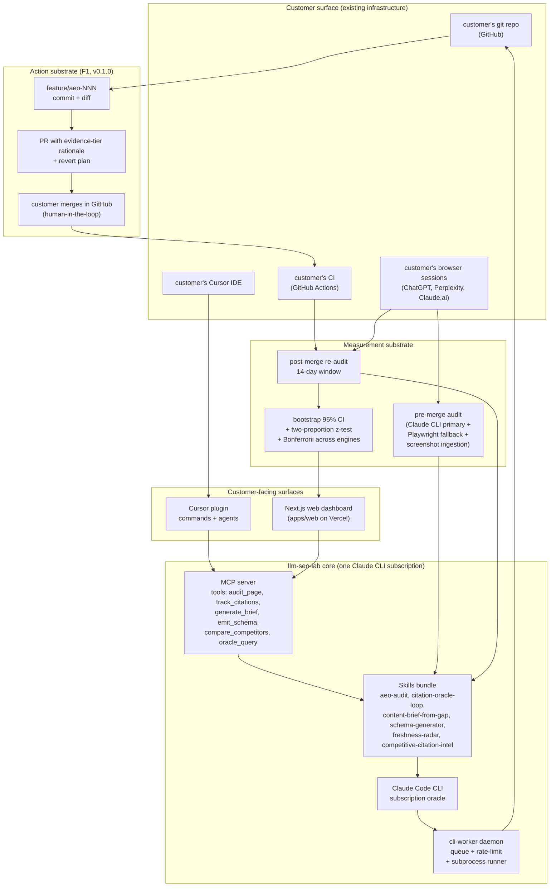

# llm-seo-lab — Design Spec

**Date:** 2026-04-25 · **Phase:** 4 · **Status:** v0.1.0 design freeze candidate · **Anchors:** [`solution-finalists.md`](../triz/solution-finalists.md), [`ariz-session.md`](../triz/ariz-session.md), [`contradiction-cards.md`](../triz/contradiction-cards.md), [`seo_research_2.md`](../research/seo_research_2.md)

This spec describes the v0.1.0 design of `llm-seo-lab` — a closed-loop autonomous citation engineering platform for AEO/LLM-SEO. It implements **Finalist F1 (PR-as-product)** as the v0.1.0 MVP and pre-wires the seams for **Finalist F2 (CMS-native publishing loop)** in v0.2.0. No code is written before this spec is approved.

---

## 1. Problem (one paragraph)

The dominant AEO tools — AthenaHQ, Profound, Otterly.AI, Peec.ai, Goodie, Geol.ai, Scrunch — are dashboards. They measure citation share with high accuracy but require humans to act on findings (the **measure↔act** contradiction, formally analysed in [`contradiction-cards.md`](../triz/contradiction-cards.md) C1). Peec.ai contractually disclaims influence; HubSpot's headline +642% page-citation lift was a confounded before/after, not an RCT; the GEO paper (KDD 2024) shows **Cite Sources / Quotation Addition / Statistics Addition** produce the only Tier-1 evidence-supported lift (30–40%). The opportunity is a system where **the act of measurement IS the intervention** — the same loop that audits opens a reviewable PR (or CMS draft) with the evidence-tier-ranked fix and re-measures after merge.

## 2. Goal (the IFR sentence from ARIZ)

> A system that, when pointed at a customer's owned content surface, **continuously closes the gap between measured AI citation share and ideal citation share with zero new infrastructure, zero new cost beyond a Claude Code CLI subscription, and zero new side effects** — every action is an explicit reviewable artifact (git PR or CMS draft) the customer accepts or rejects through their existing workflow.

## 3. Non-goals (v0.1.0)

- Multi-tenant SaaS dashboard with billing, seat management, SOC 2.
- Automatic merge / auto-publish without human review (the human-in-the-loop is the safety substrate; removing it is a v0.4+ research direction).
- Beating SOTA on every engine simultaneously — the v0.1.0 statistical claim is "Δ citation share at 14 days, attributed to merged PRs, with bootstrap 95% CI on at least 3 indie sites."
- CMS connectors (Substack/Ghost/Webflow/WordPress) — these are F2 and ship in v0.2.0.
- A federated benchmark co-op (S7) or editorial marketplace (S8) — deferred.
- Synthetic content generation. The system proposes structured-data + meta + headings + sitemap fixes and references existing content; it does not draft new prose paragraphs in v0.1.0.

## 4. Architecture overview



Five physical components:

1. **Skills bundle** (`skills/`) — Claude Code skill files: `aeo-audit`, `citation-oracle-loop`, `content-brief-from-gap`, `schema-generator`, `freshness-radar`, `competitive-citation-intel`.
2. **MCP server** (`mcp/`) — exposes 6 tools (one per skill capability) plus optional UI widgets (audit-result picker, citation-trend dashboard).
3. **Cursor plugin** (`plugin/`) — wraps the MCP server with slash commands (`/aeo:audit`, `/aeo:track`, `/aeo:brief`, `/aeo:open-pr`) and a `aeo-loop` agent that orchestrates the full closed-loop cycle.
4. **CLI worker daemon** (`packages/cli-worker/`) — long-running Node.js process that subprocess-spawns Claude Code CLI, queues jobs, enforces subscription quotas (per-tier rate limits), publishes audit/PR/measurement events to the dashboard via WebSocket.
5. **Next.js dashboard** (`apps/web/`) — Vercel-hosted; per-site audit reports, citation-share trend charts, PR queue status, statistical results panel; auth optional in v0.1.0 (localhost-only or Clerk feature-flag).

## 5. The closed loop in detail

### 5.1 Audit phase
1. Daemon clones (or shallow-fetches) the customer's repo into a sandbox dir.
2. Per-page enumeration via the customer's `sitemap.xml` (or filesystem walk for static-site repos).
3. For each page:
   - Fetch rendered HTML (via local headless browser if SPA; raw HTTP if static).
   - Extract: meta tags, JSON-LD blocks, headings (H1..H4), internal links, canonical URL, dates, schema.org types in use.
   - Run `aeo-audit` skill via Claude CLI: scores the page against the **GEO-paper evidence policy** (Cite Sources / Quotation Addition / Statistics Addition / Authoritative Tone). Output: gap report per page.

### 5.2 Brief phase
1. For each gap above the configured threshold (default: gaps with predicted citation lift > 5pp on at least one engine):
   - Run `content-brief-from-gap` skill: produces a concrete diff (JSON-LD additions, meta updates, H-tag restructure, internal-link injection, sitemap entry edits).
   - Run `schema-generator` skill: emits matching JSON-LD blocks (Article / FAQPage / HowTo / Product depending on page type).
   - Attach a **GEO-paper evidence rationale** ("This change applies the Cite Sources tactic, Tier-1 evidence: KDD 2024 GEO paper §4.2") and a **revert plan** ("To revert, drop commit X; no schema cascade").

### 5.3 PR phase
1. Daemon creates branch `feature/aeo-NNN-<short-slug>`.
2. Commits the diff with a structured commit message (type: `aeo`, scope: page slug, body: rationale + revert).
3. Opens PR via `gh CLI` with:
   - Title: `aeo: <gap-summary> on <page-slug>`
   - Body: gap report excerpt + GEO-paper rationale + before/after screenshot links + revert link + a *measurement plan* ("post-merge, will re-audit at T+1d, T+7d, T+14d on Claude CLI / Perplexity / ChatGPT samples")
   - Labels: `aeo`, `aeo-tier-1` (or `tier-2` per evidence rank)
4. Customer reviews and merges in GitHub. The system never auto-merges in v0.1.0.

### 5.4 Measurement phase
1. CI hook (or nightly cron in the daemon) detects merged `aeo` PRs.
2. Schedules re-audit jobs at T+1d, T+7d, T+14d.
3. Each re-audit runs `citation-oracle-loop` skill: queries a fixed bank of 30–50 buyer questions per topic through:
   - **Primary:** Claude CLI subprocess (the subscription oracle).
   - **Fallback:** Playwright on the customer's own browser session via `cursor-ide-browser` MCP (Perplexity, ChatGPT public UI).
   - **Evidence layer:** customer-uploaded screenshots when neither primary nor fallback is available (e.g., Perplexity-Pro-only answers).
4. Aggregates per-engine, per-question citation flags into a citation-share delta.
5. Runs the statistical analysis: two-proportion z-test (pre vs post), Bonferroni correction across engines, bootstrap 95% CI. Reports in dashboard.

### 5.5 Loop closure
- Citation lift attributed to merged PRs; no-lift PRs are flagged and the next iteration tries an alternative tactic from the GEO-paper rank.
- `freshness-radar` skill watches for citation decay (>3-month-old pages) and queues refresh PRs.
- `competitive-citation-intel` skill samples competitor-cited content monthly and surfaces gap-themes for the next cycle.

## 6. Data model (minimal, file-based in v0.1.0)

```
.llm-seo-lab/                          # in customer's repo, gitignored except cache/
├── config.yaml                        # site config: engines, sampling cadence, eval policy
├── audits/
│   └── 2026-04-25T10-00-00Z/
│       ├── pages/<slug>.json          # per-page audit
│       └── summary.json               # site-wide rollup
├── briefs/
│   └── aeo-001/
│       ├── brief.md                   # human-readable rationale
│       ├── diff.patch                 # the proposed fix
│       └── measurement-plan.json      # T+1/T+7/T+14 schedule
├── citations/
│   └── 2026-04-25T18-00-00Z/
│       └── samples.jsonl              # per-question, per-engine citation flags
└── results/
    └── pr-NNN/
        └── delta.json                 # statistical analysis: pre/post, z, p, CI
```

No database in v0.1.0. The customer's git repo is the database. JSON files are committed under `.llm-seo-lab/` with a tight `.gitignore` exclusion for ephemeral cache. The dashboard reads these files via a thin file-watcher in the daemon. v0.2.0 adds an optional Postgres backend behind an interface.

## 7. Engine coverage matrix (v0.1.0)

| Engine | Primary path | Fallback | Evidence layer |
|---|---|---|---|
| **Claude.ai** | Claude CLI direct | n/a | screenshot |
| **Perplexity** | Playwright on user session | Brave Search API for top-N | screenshot |
| **ChatGPT** | Playwright on user session | n/a | screenshot |
| **Gemini** | Playwright on user session | n/a | screenshot |
| **Google AIO** | Playwright on user session | SerpAPI optional plugin | screenshot |

The user-owned-browser route is the ToS-clean path (the user runs queries on their own logged-in account; we read the rendered DOM from their session via `cursor-ide-browser` Playwright). No vendor API keys in v0.1.0.

## 8. Failure modes and explicit fallback behaviour

| Failure | Detection | Fallback |
|---|---|---|
| Claude CLI quota exceeded | subprocess returns rate-limit error | daemon throttles to next-quota-window; queue holds jobs; dashboard surfaces queue depth |
| Customer repo has no `.llm-seo-lab/config.yaml` | bootstrap step missing | first-run wizard generates it from `gh repo view` defaults; commits via PR `aeo: bootstrap` |
| Customer blocks AI crawlers in `robots.txt` | audit detects `Disallow: /` for `OAI-SearchBot`, `PerplexityBot`, `ClaudeBot`, etc. | daemon downgrades to *advisory mode*: PRs are still drafted but flagged "blocked by robots.txt — must unblock first" with a one-line `robots.txt` patch as PR #1 |
| Customer's Playwright session times out | session manager returns auth-expired | daemon notifies customer to re-authenticate via the dashboard (one-click flow); falls back to screenshot ingestion until re-auth |
| Customer rejects a PR | PR closed unmerged after 14d | daemon flags PR as `customer-rejected`, reduces priority of similar tactics in next iteration, surfaces in dashboard |

## 9. Non-functional requirements

- **Latency:** audit-to-PR open under 5 minutes for a typical 50-page site.
- **Throughput:** 1 dogfood site continuously + ≥3 customer sites in parallel on a single Mac/Linux dev box.
- **Cost:** zero infrastructure beyond Vercel free tier + Claude Code CLI subscription. No paid API keys in v0.1.0.
- **Privacy:** no customer content leaves the customer's machine except (a) Claude CLI subprocess (encrypted, subscription account), and (b) optional dashboard which can be self-hosted.
- **Reproducibility:** every audit / brief / measurement is deterministic given the same input + same Claude model snapshot; results JSON includes model version + timestamp + git SHA.
- **Observability:** structured JSON logging via the daemon; per-skill traces; dashboard exposes "why was this PR opened?" lineage view.

## 10. Open questions deferred to PRD/plan

- Pricing tier rules (PRD §4).
- Cursor plugin command surface vs MCP-tool surface split (plugin-architecture §3).
- MCP UI widget choice (build-mcp-app §4).
- Test pyramid sizing (implementation plan §5).

## 11. v0.2.0 hooks (so we don't paint ourselves into a corner)

The v0.1.0 build must include the following extension points so v0.2.0 (F2 CMS-native loop) lands without rewrites:

- Skills bundle: `aeo-audit` accepts an `action_substrate` parameter (`"git"` in v0.1.0; future: `"substack"`, `"ghost"`, `"webflow"`).
- MCP server: `oracle_query` is split into `oracle_query` + `sampling_oracle` (the latter is the fallback Playwright path, already pluggable).
- CLI worker: action-substrate plugins are loaded by name; v0.1.0 ships only `git-substrate.ts`.
- Dashboard: per-site config has a `substrate` field; v0.1.0 enforces `git`; v0.2.0 unlocks `substack`, `ghost`, `webflow`.

## 12. Spec sign-off checklist

- [x] North-star goal restated as IFR.
- [x] Architecture diagram present.
- [x] Closed loop described phase-by-phase.
- [x] Data model minimal and file-based for v0.1.0.
- [x] Engine coverage matrix with primary/fallback/evidence layers.
- [x] Failure modes documented.
- [x] Non-functional requirements quantified.
- [x] v0.2.0 hooks identified.
- [x] No-code constraint honoured (this is a doc, not implementation).
- [x] Anchored to TRIZ deliverables (contradiction-cards, ariz-session, solution-finalists).
