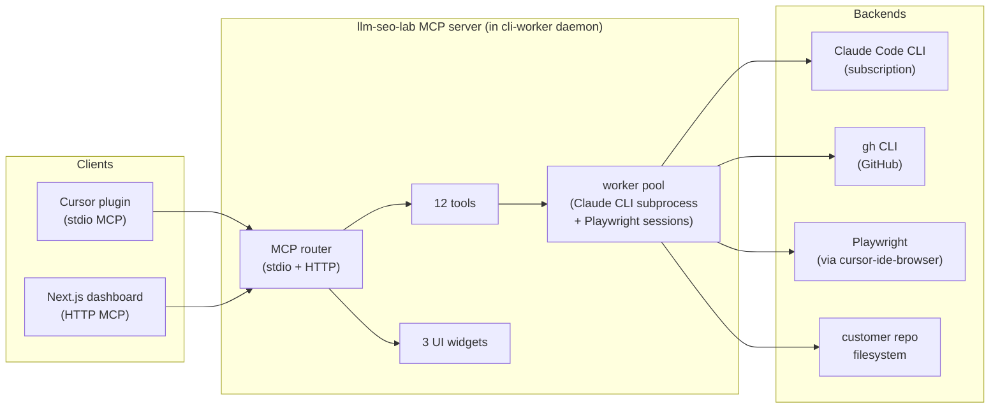

# llm-seo-lab — MCP Server Design

**Date:** 2026-04-25 · **Phase:** 4 · **Status:** v0.1.0 MCP design freeze candidate · **Anchors:** [`2026-04-25-llm-seo-lab-design.md`](2026-04-25-llm-seo-lab-design.md), [`plugin-architecture.md`](plugin-architecture.md)

This document specifies the MCP server that backs the Cursor plugin and the web dashboard. It uses the `build-mcp-app` skill's pattern: tools (data + IO), optional UI widgets (rendered inline in chat or in the dashboard), and an HTTP transport for the dashboard's server-side calls.

---

## 1. Server topology



The MCP server lives **inside the cli-worker daemon** (`packages/cli-worker/`) — this is intentional: a single process owns the Claude CLI subprocess pool, the Playwright sessions, and the filesystem watcher, so there is one place to enforce subscription rate limits and one place to publish progress to the dashboard via WebSocket.

Two transports:
- **stdio** for the Cursor plugin (per the standard MCP plugin contract).
- **HTTP** for the Next.js dashboard server actions. Dashboard never gets a direct Claude CLI handle; it always goes through the MCP server so quotas are honoured.

## 2. The 12 tools

| # | Tool | Inputs | Outputs | Backend |
|---|---|---|---|---|
| 1 | `read_repo_metadata` | `repo_path` | repo type, sitemap path, page count | FS + `gh repo view` |
| 2 | `read_config` | `repo_path` | parsed `.llm-seo-lab/config.yaml` | FS |
| 3 | `write_config` | `repo_path`, `config` (object) | `{written: true, path}` | FS |
| 4 | `audit_page` | `repo_path`, `page_url` | gap report (per-tactic scores + predicted lift) | Claude CLI |
| 5 | `generate_brief` | `repo_path`, `gap_id` | brief markdown + diff + measurement-plan JSON | Claude CLI |
| 6 | `emit_schema` | `page_metadata` | JSON-LD blocks (Article / FAQPage / HowTo / Product) | Claude CLI |
| 7 | `open_pr` | `repo_path`, `brief_id` | `{pr_number, pr_url, branch}` | `gh CLI` |
| 8 | `oracle_query` | `topic`, `question`, `engine` | citation flag + cited URL + snippet + provenance | Claude CLI \| Playwright |
| 9 | `track_citations` | `repo_path`, `topic`, `window` | per-engine citation share + statistical analysis JSON | Claude CLI + stats lib |
| 10 | `compare_competitors` | `repo_path`, `topic` | competitor citation map + gap-themes | Claude CLI + `oracle_query` |
| 11 | `read_pr_status` | `repo_path`, `pr_number?` | PR(s) state, merge status, age | `gh CLI` |
| 12 | `read_results` | `repo_path`, `pr_number?` | results JSON (pre/post deltas, p-values, CIs) | FS |

### Tool detail — `audit_page`

```typescript
// MCP tool descriptor (excerpt)
{
  name: "audit_page",
  description: "Audit a single page for AEO/LLM-SEO citation-worthiness against the GEO-paper evidence policy. Returns per-tactic scores and predicted citation-share lift.",
  inputSchema: {
    type: "object",
    properties: {
      repo_path: { type: "string", description: "Absolute path to customer repo." },
      page_url: { type: "string", description: "Public URL or repo-relative path of the page." }
    },
    required: ["repo_path", "page_url"]
  },
  outputSchema: {
    type: "object",
    properties: {
      page_url: { type: "string" },
      audit_id: { type: "string", description: "Stable id used by generate_brief." },
      timestamp: { type: "string", format: "date-time" },
      claude_model: { type: "string" },
      scores: {
        type: "object",
        properties: {
          cite_sources: { type: "number", minimum: 0, maximum: 100 },
          quotation_addition: { type: "number", minimum: 0, maximum: 100 },
          statistics_addition: { type: "number", minimum: 0, maximum: 100 },
          authoritative_tone: { type: "number", minimum: 0, maximum: 100 },
          schema_coverage: { type: "number", minimum: 0, maximum: 100 }
        }
      },
      gaps: {
        type: "array",
        items: {
          type: "object",
          properties: {
            gap_id: { type: "string" },
            tactic: { type: "string", enum: ["cite_sources", "quotation_addition", "statistics_addition", "authoritative_tone", "schema_coverage", "internal_link_injection", "freshness"] },
            predicted_lift_pp: { type: "number", description: "Predicted citation-share lift in percentage points." },
            evidence_tier: { type: "string", enum: ["tier1", "tier2", "tier3"] },
            geo_paper_reference: { type: "string" },
            page_locator: { type: "string", description: "CSS selector or line range." }
          }
        }
      }
    }
  }
}
```

The other 11 tools follow the same shape: explicit input/output schemas, every output traceable to a primary source (Claude CLI run id, gh CLI PR number, file path).

## 3. Tool composition pattern

The agent (`aeo-loop`) and the dashboard server actions compose tools in fixed sequences:

```
read_repo_metadata
  └─> read_config         # if missing, write_config + open_pr (bootstrap PR)
        └─> for each page:
              audit_page
                └─> for each gap above threshold:
                      generate_brief
                        └─> emit_schema
                              └─> open_pr
                                    └─> (wait, see hook on-pr-merge)
                                          └─> read_pr_status
                                                └─> if merged: track_citations
                                                      └─> read_results
```

Tools are **pure** in the sense that the same inputs yield the same outputs (modulo Claude model snapshot drift, which is recorded in the output `claude_model` field). State lives on disk under `.llm-seo-lab/`.

## 4. UI widgets (build-mcp-app pattern)

Three widgets, each rendered as MCP UI resources viewable inline in the chat or embedded in the dashboard. Per the build-mcp-app skill: widgets are HTML/JS bundles that the MCP client renders in an inline frame.

### Widget 1 — `audit-summary`
- **Renders:** site rollup (page count, gap count, top tactics, predicted aggregate lift).
- **Inputs:** audit run id.
- **Why a widget:** scannable table > 2000-token markdown dump in chat.

### Widget 2 — `pr-queue`
- **Renders:** open / merged / rejected PRs with measurement schedule and current delta.
- **Inputs:** repo path.
- **Why a widget:** real-time status with WebSocket subscription; lets the customer see the loop live.

### Widget 3 — `citation-trend`
- **Renders:** time-series chart of citation share per engine, with PR-merge annotations.
- **Inputs:** topic id, window.
- **Why a widget:** chart > tabular dump.

Widgets use the `@mcp-ui/react` runtime per the build-mcp-app skill convention. They are also embeddable in the Next.js dashboard via React server components that render the same payloads.

## 5. Worker pool

The MCP server owns three pools:

- **Claude CLI worker pool.** Subprocesses spawned on demand; max concurrency = 2 by default (configurable per subscription tier). Each worker holds a session id, accepts tool calls, returns structured output.
- **Playwright session pool.** One session per (engine × user-account) tuple. Sessions are lazy-created on first `oracle_query` for that engine and held open with periodic keepalive. Authentication is delegated to `cursor-ide-browser` MCP.
- **Filesystem watcher.** Single `chokidar` watcher per customer repo path; emits events to WebSocket clients (the dashboard's PR-queue widget subscribes to these).

## 6. Rate limiting and quota enforcement

- Per-tool budgets are configurable via `.llm-seo-lab/config.yaml` (`rate_limits.audit_page_per_minute`, `rate_limits.oracle_query_per_minute`, etc.).
- The cli-worker daemon enforces a global subscription-tier cap (Indie: 10/min, Builder: 30/min, Studio: 60/min, Pro: 120/min — these are MCP-tool-call rates, not Claude API rates).
- When the cap is hit, the MCP tool call returns `{status: "queued", queue_position, estimated_wait_seconds}` instead of a synchronous result. The plugin/agent handle the queued response by polling.

## 7. Error model

All tools return either a successful result or an error envelope:

```json
{
  "error": {
    "code": "QUOTA_EXCEEDED" | "CLAUDE_CLI_FAILED" | "PLAYWRIGHT_AUTH_EXPIRED" | "GH_CLI_FAILED" | "INVALID_INPUT" | "FILESYSTEM_ERROR" | "NOT_FOUND" | "INTERNAL",
    "message": "human-readable explanation",
    "retry_after_seconds": 60,
    "actionable_next_step": "..."
  }
}
```

`actionable_next_step` is a deliberately user-facing string the agent can echo to the user; it shortens the loop between failure and recovery.

## 8. Telemetry (opt-in)

If `.llm-seo-lab/config.yaml` has `telemetry: true`:
- Tool-call name + duration + success/failure (no payloads, no customer content).
- Aggregate citation-share deltas (anonymised, per-engine).
- Daemon CPU/memory.

Sent to a Vercel Edge function endpoint that writes to a Postgres instance for product analytics. Default is `false` — explicit opt-in only. This is the **federated benchmark co-op (S7) substrate** that ships in v0.5+.

## 9. Security model

- Plugin runs in Cursor's plugin sandbox; reads/writes only inside the workspace.
- MCP server runs as the user's local process; same trust boundary as `gh CLI`.
- No customer content is sent to any third party except Claude CLI (subscription account) and the engines the customer chooses to query (their own logged-in browser sessions).
- `gh CLI` PR open uses the user's existing `gh auth` token; never asks for a new credential.
- All Playwright sessions are local Chromium instances using the user's OS keychain credentials via `cursor-ide-browser`.

## 10. Backwards compatibility for v0.2.0

- New tool slot reserved: `cms_publish_draft` (F2 Substack/Ghost adapter).
- New transport slot reserved: `webhook` for CMS-side callbacks.
- The `action_substrate` field on briefs is parameterised so v0.2.0 can route to CMS instead of `gh CLI` without changing the brief generator.

## 11. MCP design sign-off checklist

- [x] Server topology diagrammed.
- [x] All 12 tools enumerated with input/output schemas (one example expanded; pattern applied to all).
- [x] Composition pattern documented.
- [x] UI widgets (3) defined with rationale per build-mcp-app skill.
- [x] Worker pools and rate limits specified.
- [x] Error model specified.
- [x] Telemetry opt-in policy explicit.
- [x] Security model documented.
- [x] v0.2.0 extension slots reserved.
