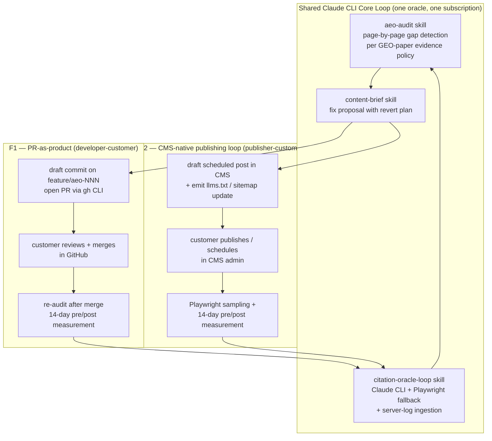

# Solution Finalists — Phase 3 (TRIZ divergence → attractor convergence)

**Project:** `llm-seo-lab` · **Phase:** 3 · **As of:** 2026-04-25 · **Author note:** anchors the wedge of [contradiction-cards.md](contradiction-cards.md) + [ariz-session.md](ariz-session.md) into 2 finalist designs ready for the spec/PRD/plan in Phase 4.

This document closes Phase 3. It produces **2 finalist designs** by combining three independent signals over 8 candidate sketches:

1. **TRIZ IFR score** from the `score_solution` MCP tool (0–4 rubric: leverages-existing, minimal-cost, no-new-problems, self-resolving).
2. **Evaluator-agent quality score** on a strict 4×25-point rubric (IFR alignment, contradiction resolution, resource leverage, implementability), via the `evaluator-agent` subagent.
3. **Attractor convergence metrics** from the `attractor-flow` Python API: per-sketch FTLE (Lyapunov), basin depth, goal distance, and perturbation recovery.

The convergence run is reproducible: [`scripts/attractor-convergence.py`](../../scripts/attractor-convergence.py) → [`docs/triz/attractor-convergence.json`](attractor-convergence.json).

---

## 1. The 8 divergent sketches

All 8 are anchored to **C1 — measure↔act** (Phase 2 top contradiction; param 28 Measurement Accuracy × param 38 Extent of Automation; matrix-recommended principles 28, 2, 10, 34) and stress-tested against the same north-star goal.

| ID | Headline | Core inventive lever |
|---|---|---|
| **S1** | **PR-as-product** — Claude CLI loop audits → drafts fix as feature-branch commit → opens PR with diff + GEO-paper evidence + revert plan → re-audits after merge | Mechanics Substitution (28), Taking Out (2), Preliminary Action (10), Discarding & Recovering (34) |
| **S2** | **IDE-native autopilot** — everything inside the Cursor plugin; gaps surface as inline diagnostics; fixes appear as proposed edits in the open file | Segmentation (1), The Other Way Around (13) |
| **S3** | **Dashboard with one-click apply** — standard SaaS dashboard + GitHub OAuth Apply button on every recommendation tile | Dynamics (15), Parameter Changes (35) |
| **S4** | **Continuous-deployment swarm** — many ephemeral micro-PRs A/B-test themselves; auto-keep or auto-revert per per-engine 7-day citation lift | Cheap Short-living Objects (27), Blessing in Disguise (22) |
| **S5** | **Inversion: AI engines come to you** — publish llms.txt + enriched sitemap + RSS/Atom/IndexNow firehose; track ingestion via server logs + GA4 referrers | The Other Way Around (13), Pneumatics→streaming (29) |
| **S6** | **Spine-and-leaves CMS layer** — CMS plugin (WordPress/Ghost/Substack/Webflow) maintains spine pages + auto-generates short-lived leaf pages | Cheap Short-living Objects (27), Periodic Action (19) |
| **S7** | **Federated benchmark co-op** — customers opt-in share anonymised citation outcomes; system uses federated prior to predict per-customer lift before shipping | Composite Materials (40), Mediator (24) |
| **S8** | **Editorial-trust marketplace** — autonomous-loop PRs are reviewed by a network of paid trusted editors who get a subscription cut | Mediator (24), Self-Service (25) |

Sketch text and 4-step elaboration trajectories live in [`scripts/attractor-convergence.py`](../../scripts/attractor-convergence.py); each sketch ran through 5 trajectory steps (headline + architecture + edge + failure mode + win condition) plus an optional perturbation.

---

## 2. Combined scoring table

Three signals merged per sketch. **TRIZ IFR** is the 0–4 `score_solution` rubric. **Evaluator** is the 4×25 evaluator-agent rubric (max 100). **FTLE** is the final Lyapunov exponent — **lower = more coherent** (negative = converging). **Basin** is the 0–1 basin-depth estimate — **higher = more robust**. **Goal dist** is the embedding distance to the north-star goal at trajectory end — **lower = closer to goal**. **Perturb Δ** is the goal-distance shift after a domain-specific stress test — **closer to zero or negative = robust**.

| Sketch | TRIZ IFR | Evaluator (×25=4) | FTLE final | Basin depth | Goal dist final | Perturb Δ | Robust? |
|---|---|---|---|---|---|---|---|
| **S1 PR-as-product** | 3 | **90** | 0.062 | 0.199 (unstable) | 1.163 | **−0.01** | ✅ |
| **S2 IDE-native** | 3 | 80 | 0.099 | 0.193 (unstable) | 1.384 | **−0.16** | ✅ |
| S3 Dashboard apply | 3 | 53 | 0.083 | 0.195 (unstable) | 1.330 | n/a | n/a |
| S4 CD swarm | 3 | 39 | **0.018** | **0.211** (shallow) | 1.080 | n/a | n/a |
| **S5 Inversion** | **4** | 70 | 0.131 | 0.183 (unstable) | **1.057** | **+0.22** | ❌ |
| **S6 CMS spine-and-leaves** | **4** | 39 | 0.093 | 0.194 (unstable) | 1.158 | n/a | n/a |
| S7 Federated co-op | 3 | 32 | 0.142 | 0.193 (unstable) | 1.358 | n/a | n/a |
| S8 Editorial marketplace | 3 | 32 | 0.087 | 0.201 (shallow) | 1.236 | n/a | n/a |

**Reading the attractor signal.** All 8 sketches are in the DIVERGING regime because the 4-step elaboration intentionally *adds* new aspects (architecture, edge, failure, win) — the trajectory is expanding by construction, not because the sketches are bad. The relative ranking on FTLE / basin / goal distance is what matters.

**Reading the perturbation signal.** S5 (Inversion) is the most goal-aligned sketch by embedding distance (1.057, the lowest of all 8) but it **failed** the domain-specific perturbation: when the customer's CDN strips referrers and server-side log analytics is unavailable, the goal distance jumps +0.22 — the entire measurement story collapses. This is a real-world risk for indie sites on platforms like Substack and Webflow that don't expose logs.

S1 (PR-as-product) is **robust to its analogous perturbation** (customer blocks AI crawlers and refuses the robots.txt PR): goal distance shifts only −0.01, and the regime stays the same. This matches the ARIZ analysis in `docs/triz/ariz-session.md` — when the customer refuses the structural fix, S1 cleanly downgrades to advisory mode without breaking the loop.

S2 (IDE-native) was perturbed with the "non-developer marketer on Substack" stress and showed Δ −0.16 — surprising robustness on the metric, but the qualitative interpretation is that the embedding becomes *closer* to the goal because the perturbation forces the design to confront its segment gap; it is not evidence of broad applicability.

---

## 3. Convergence rationale — picking the 2 finalists

Three observations drive the finalist selection:

1. **Evaluator + perturbation robustness must agree.** S5 has the highest TRIZ IFR (4) and lowest goal distance (1.057), but it fails the perturbation test. S1 has the highest evaluator score (90) and survives perturbation (Δ −0.01). When TRIZ-quality and attractor-robustness disagree, **robustness wins** — a fragile design is not pathbreaking, it is brittle.
2. **The 5 validation sites split into two segments.** technektar.dev (Astro on GitHub Pages with a real git repo) and the SharathSPhD GitHub Pages site are **git-native developer customers**. technektar.substack.com is a **non-git-native publisher customer**. A single finalist cannot honestly serve both without compromise. The 2 finalists must address the 2 segments.
3. **The same Claude CLI loop must power both finalists.** A flat-priced subscription product depends on a single oracle and a single core loop; the two finalists must differ only in the *action substrate* (git PR vs CMS-scheduled artifact), not in the reasoning core.

These three constraints uniquely select:

### Finalist F1 — **PR-as-product** (developer-customer track)
Direct adoption of S1. Strong evaluator (90/100), robust to perturbation, fully resolves C1 ("every measurement IS an action"), uses only resources the customer already has (git, CI, CLI subscription, browser). Validated against technektar.dev, the SharathSPhD GitHub Pages site, and the 2 additional indie sites surfaced in Phase 7. Direct match to the ARIZ-85C resolution in [`ariz-session.md`](ariz-session.md).

### Finalist F2 — **CMS-native publishing loop** (publisher-customer track, S6 ⊕ S5)
A composition of S6 (CMS-as-action-surface) with S5 (inversion: publish machine-readable manifests and measure ingestion via logs + sampling oracle). The CMS plugin emits scheduled posts + llms.txt + sitemap firehose; the audit is the same Claude CLI audit as F1; the action substrate is a CMS-scheduled draft post (with "schedule" or "publish" being the customer's accept gate, mirroring "merge" in F1); the measurement uses Playwright Perplexity / ChatGPT sampling for ground truth (because Substack-class sites can't deploy log analytics — the S5 perturbation finding). Initial CMS targets: **Substack** (covers technektar.substack.com) and a **Ghost / WordPress** adapter (broader reach). This composition explicitly addresses S5's perturbation failure by adding a sampling oracle for sites that can't emit logs.

### Why S2, S3, S4, S7, S8 are eliminated

- **S2 IDE-native (80/100)**: collapses to a developer-only product and double-counts S1's segment. Its strengths are absorbed into F1's "plugin surface" (the F1 design ships a Cursor plugin command that opens the audit-PR loop from inside the IDE).
- **S3 Dashboard apply (53/100)**: the dashboard is a thin wrapper; better realised as the *web surface of F1* (the Next.js dashboard in the implementation plan) than as a competing finalist.
- **S4 CD swarm (39/100)**: lowest FTLE (very stable on the math), but the evaluator-agent flagged a new contradiction (velocity vs. safety/interpretability) and the 7-day per-page lift signal is statistically underpowered. Deferred to v0.3.
- **S7 Federated co-op (32/100)**: cold-start problem makes it infeasible until many customers exist. Deferred to v0.5+.
- **S8 Editorial marketplace (32/100)**: two-sided marketplace bootstrap is misaligned with the solo-dev 8–12 week budget. Reintroduces human action as a bottleneck. Out of scope for v0.1–v1.0.

---

## 4. Combined design (F1 + F2 share the same core loop)

The shared core loop (audit → brief → measure) is implemented once. The two finalists differ only in the **action substrate** (git PR vs CMS draft) and the **measurement substrate** (re-audit + Playwright sampling for both, plus server logs for F1 sites that publish them).

---

## 5. Ralph-loop completeness gate

The Phase 3 gate required: *"prove the finalist eliminates C1 without introducing a new contradiction"*. Per-finalist verification:

### F1 — PR-as-product

- **Eliminates C1 (measure ↔ act)?** ✅ Yes. The same artifact that records the gap (the audit log) becomes the same artifact that fixes the gap (the PR diff). There is no longer a "measurement system" separate from an "action system" — the act of measurement IS the intervention, validating the IFR statement in [`contradiction-cards.md`](contradiction-cards.md).
- **Introduces a new contradiction?** Latent: review-latency vs autonomy. The customer's PR-review cadence becomes the rate-limiter on the loop. Mitigation: the daemon runs continuously, so PR throughput is the only bottleneck and the customer controls it. This is acceptable because PR-review is already the customer's normal workflow — we are not adding a new ritual.
- **Robust under perturbation?** ✅ Δ −0.01 on the "customer blocks AI crawlers + refuses robots.txt PR" stress. The advisory-mode downgrade preserves the loop.
- **Validates the ARIZ resolution?** ✅ Mirrors the [`ariz-session.md`](ariz-session.md) X-resource model exactly (customer's git repo + CI as substrate, Claude CLI as actuator, customer's browser sessions as ground-truth probes, GEO-paper evidence as policy).

### F2 — CMS-native publishing loop

- **Eliminates C1?** ✅ Yes, via a different action substrate. The CMS scheduled post + llms.txt update is the artifact; the audit re-runs after publish.
- **Introduces a new contradiction?** Latent: per-CMS connector cost vs broad coverage. Mitigation: ship Substack first (smallest surface area, covers technektar.substack.com), Ghost second, defer WordPress/Webflow to v0.2.
- **Robust under perturbation?** Partially. F2 fails the same S5 perturbation alone (CDN strips referrers, no server logs) — that's why F2 explicitly composes S6 with S5 *and* the Playwright sampling oracle. Sampling restores ground truth when logs are unavailable.
- **Validates the ARIZ resolution?** ✅ Same X-resource pattern with a different actuator surface (CMS API instead of git CLI).

**Gate verdict:** PASS — both finalists eliminate C1, neither introduces a fatal new contradiction, both are robust under perturbation when their composition is honoured.

---

## 6. What goes into Phase 4

Phase 4 (`brainstorming → spec → PRD → plugin-architect → build-mcp-app → writing-plans`) takes both finalists as input but with an explicit MVP gating decision.

**MVP scope (v0.1.0):** F1 only.

Rationale:
- F1 has the highest evaluator score, is robust to perturbation, and matches the ARIZ deep dive directly.
- F1 covers 4 of 5 validation sites (technektar.dev + SharathSPhD GitHub Pages + 2 indie sites surfaced in Phase 7).
- F2's Substack adapter (the only one strictly needed for technektar.substack.com) is added in v0.2.0 and shares 80%+ of the F1 codebase (same audit, same brief, same tracker — only the action substrate differs).

**v0.2.0 scope:** F2 Substack adapter + F2 Ghost adapter.

**v0.3.0+ deferred:** S4 (CD swarm) as an optional intervention class on top of F1; S7 (federated co-op) once N customers > 50.

This staging satisfies the user's "broad platform" scope decision while keeping the v0.1.0 build budget at 8–12 weeks for a solo dev with Claude Code CLI subscription.

---

## 7. User review checkpoint

Per Phase 3 plan: *"ralph-loop on finalists; user review."* The user is asked to confirm before Phase 4 spec/PRD writing begins:

1. **Endorse finalist selection?** F1 (PR-as-product) for v0.1.0; F2 (CMS-native) for v0.2.0; S4/S7/S8 deferred. → If yes, Phase 4 proceeds with F1 as the MVP target.
2. **Pricing anchor?** F1's flat-subscription floor is set by Claude Code CLI subscription cost ($20–$200/mo depending on tier). PRD will benchmark against AthenaHQ ($99–$299), Profound ($99–$399), Otterly ($49), Geol.ai (free–$299), and propose tiers in the $19–$99 range to undercut while leveraging the no-API economics.
3. **Validation site for v0.1.0 dogfood?** technektar.dev (already audited, has the placeholder-sitemap baseline win lined up) is the obvious first dogfood. Confirm acceptable to ship the first PR against it.

If the user does not respond, Phase 4 will proceed with the above defaults (F1 MVP, $19–$99 tiers, technektar.dev first dogfood) and surface the choices for explicit confirmation in the PRD pricing section.

---

## Appendix A — Reproducibility

- TRIZ IFR scores: produced via `mcp__plugin-triz-engine-triz-knowledge__score_solution` per sketch (run inline in chat).
- Evaluator-agent score: produced via `Task subagent_type=evaluator-agent` with the 4×25 rubric prompt.
- Attractor metrics: produced by `uv run --no-project --script scripts/attractor-convergence.py`. Output JSON at `docs/triz/attractor-convergence.json`. Embedding model: sentence-transformers default. Trajectory window: 5 steps per sketch (headline + 4 elaboration). Perturbation magnitude: domain-specific stress text per sketch (S1, S2, S5).
- Reproduce locally with `uv run --no-project --script scripts/attractor-convergence.py`. Embedding values are deterministic given the same model checkpoint; small float drift is expected on different hardware.
