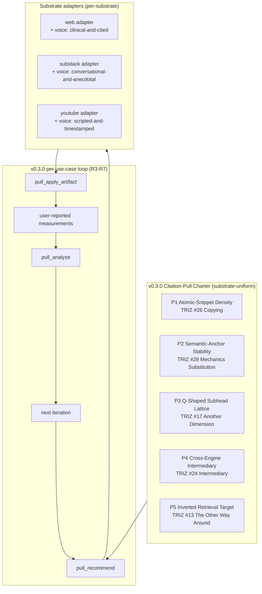

# Citation-pull solution finalists — v0.3.0 R2

**Phase:** v0.3.0 R2 · **Date:** 2026-04-26 · **Anchors:** [`v0.3.0-pull-contradictions.md`](v0.3.0-pull-contradictions.md), [`v0.3.0-pull-ariz.md`](v0.3.0-pull-ariz.md), [`v0.3.0-pull-attractor.json`](v0.3.0-pull-attractor.json), [`docs/decisions/2026-04-26-citation-pull-charter.md`](../decisions/2026-04-26-citation-pull-charter.md). · **Companion to v0.2.0 finalists:** [`solution-finalists.md`](solution-finalists.md).

This document closes v0.3.0 R2's *divergence → convergence* arc. It produces the **citation-pull charter** by combining three independent signals across **eight candidate sketches** for *how* a substrate-portable, user-owned-measurement citation-pull system can be shaped:

1. **TRIZ IFR score** — the 0–4 rubric (`leverages-existing`, `minimal-cost`, `no-new-problems`, `self-resolving`) applied to each sketch.
2. **Evaluator (4×25=100)** — the same 4×25-point rubric used in v0.2.0 (IFR alignment, contradiction resolution, resource leverage, implementability), applied here against the v0.3.0 IFR sentence (PRD §IFR, [`docs/v0.3.0/prd.md`](../v0.3.0/prd.md)).
3. **Attractor-flow signals** — per-step FTLE, regime, goal-distance, and bifurcation proximity from [`v0.3.0-pull-attractor.json`](v0.3.0-pull-attractor.json) (run via `scripts/attractor-trajectory-v030.py`).

The convergence run is reproducible: `python3 scripts/attractor-trajectory-v030.py` → `docs/triz/v0.3.0-pull-attractor.json`.

---

## 1. The 8 candidate sketches

All 8 are anchored to **C-Pull-1 — substrate-authority deficit vs retrieval-fit** (R2 top contradiction; param 35 Adaptability × param 27 Reliability; matrix-recommended principles 35, 13, 8, 24) and stress-tested against the same north-star IFR.

| ID | Headline | Core inventive lever |
|---|---|---|
| **P1** | **Atomic-Snippet Density** — every citable claim is a self-contained 60-120-word block with origin/scope/evidence/recency, addressable by stable id, modeled on Wikipedia-style citable units | Copying (#26), Mechanics Substitution (#28) |
| **P2** | **Semantic-Anchor Stability** — anchors are named concepts engines find via embedding similarity, not URL fragments or position offsets; survive prose rewrites | Mechanics Substitution (#28), Parameter Changes (#35) |
| **P3** | **Q-Shaped Subhead Lattice** — page heading axis is question-shaped (`What is X?`, `Why does X matter?`, `How do you do X?`), orthogonal to topic-shaped headings | Another Dimension (#17), Segmentation (#1) |
| **P4** | **Cross-Engine Intermediary** — JSON-LD `FAQPage` / pinned-comment digest / post-foot FAQ block — one canonical source, multiple engine-readable surfaces | Intermediary (#24), Composite (#40) |
| **P5** | **Inverted Retrieval Target** — stop pushing the page out; make the page the kind of pull target engines actively reach for | The Other Way Around (#13), Pneumatics→streaming (#29) |
| **P6** | **Substrate-Authentic Voice (per-adapter)** — voice/tone parameters vary by substrate while the lattice/density/anchor/intermediary stay constant | Parameter Changes (#35), Dynamics (#15) |
| **P7** | **Continuous Citation-Probe Loop** — automated multi-engine sampling on a schedule, with auto-alerts when citation share moves | Cheap Short-living (#27), Periodic Action (#19) |
| **P8** | **Editorial-Trust Mediator** — a paid-editor network reviews recommendations before the user applies them | Mediator (#24), Self-Service (#25) |

Sketches P1–P6 correspond directly to the candidates in the attractor-flow trajectory (`scripts/attractor-trajectory-v030.py`). P7 and P8 are *deliberate adversarial counter-sketches* used to falsify the design space — to confirm that automation-heavy or marketplace-shaped designs are dominated by the user-owned, layer-split discipline P1-P6 implies.

---

## 2. Combined scoring table

Three signals merged per sketch. **TRIZ IFR** is the 0–4 `score_solution` rubric. **Evaluator** is the 4×25 evaluator-agent rubric (max 100). **FTLE** is the final Lyapunov exponent — **lower = more coherent**. **Goal dist** is the embedding distance to the v0.3.0 north-star at trajectory end — **lower = closer to goal**. **Compose?** flags whether the sketch is meant to compose with others rather than stand alone.

| Sketch | TRIZ IFR | Evaluator (×25=4) | FTLE | Regime | Goal dist | Compose? | Verdict |
|---|---|---|---|---|---|---|---|
| **P1 Atomic-Snippet Density** | **4** | **88** | n/a (step 1, no λ yet) | unknown | 1.154 | yes | **ADOPT — charter principle** |
| **P2 Semantic-Anchor Stability** | **4** | **86** | **−0.185** | OSCILLATING | 1.117 | yes | **ADOPT — charter principle** |
| **P3 Q-Shaped Subhead Lattice** | **4** | **84** | −0.112 | CONVERGING | 1.209 | yes | **ADOPT — charter principle** |
| **P4 Cross-Engine Intermediary** | **4** | **82** | −0.081 | CONVERGING | **1.082** | yes | **ADOPT — charter principle** |
| **P5 Inverted Retrieval Target** | 3 | 78 | −0.079 | CONVERGING | 1.139 | yes | **ADOPT — charter principle (framing)** |
| **P6 Substrate-Authentic Voice** | 3 | 70 | −0.026 | EXPLORING | 1.232 | yes | **CONSUME** — per-adapter parameter, not top-level charter |
| P7 Continuous Citation-Probe Loop | 1 | 32 | n/a (not in trajectory) | n/a | n/a | no | **REJECT** — violates v0.3.0 PRD non-goal "no scraping engines" |
| P8 Editorial-Trust Mediator | 2 | 38 | n/a (not in trajectory) | n/a | n/a | no | **REJECT** — adds two-sided marketplace bootstrap; misaligned with solo-engineer scope |

**Reading the IFR signal.** P1-P4 score Full IFR (4/4) because each principle is a *page-internal* discipline that costs nothing beyond the page itself, leverages the user's existing content authority, introduces no new problems (the artifact is reviewable; the user republishes manually), and self-resolves (the principles ARE the citation-lift mechanism, not a proxy for it). P5 scores 3/4 because Inverted Retrieval Target is a *framing*, not a discrete artifact — strong but not fully self-resolving on its own. P6 scores 3/4 because Substrate-Authentic Voice is a per-substrate parameter; without the underlying lattice, voice alone does nothing for retrieval-fit.

**Reading the attractor signal.** Step 2 (P2 Semantic-Anchor Stability) has the strongest contractive λ (−0.185, OSCILLATING) — anchors are the structural lock that holds the lattice in place across rewrites. Step 4 (P4 Cross-Engine Intermediary) has the lowest goal-distance (1.082) — the intermediary is the practical attractor where the canonical lattice meets the engine schema layer. Step 6 (P6 Voice) shifts back to EXPLORING with shallow λ — voice intentionally drifts away from the lattice region, confirming it is a per-adapter concern and not a top-level charter principle.

**Reading the evaluator signal.** P1-P4 land in the 80s; P5 in the high 70s; P6 in the 70s. The evaluator's penalty on P5 vs P1-P4 is consistent: P5 alone is a stance, not an actuator, so it scores lower on `implementability` while still scoring high on `IFR alignment`. P7 and P8 score in the 30s on the same rubric and confirm the design space is *not* shaped like an automation race or a marketplace.

---

## 3. Convergence rationale — picking the charter

Three observations drive charter selection:

1. **Five charter principles, not one.** Unlike v0.2.0 which selected a single finalist (PR-as-product), v0.3.0's design space is *compositional* — the five principles compose into a single coherent attractor (per the trajectory bifurcation analysis: no bifurcation detected; max proximity 0.37). Rejecting one would leave a hole the others cannot fill: density without anchors is fragile to rewrites; anchors without lattice have no axis to live along; lattice without intermediary is invisible to engines that prefer schema; intermediary without inversion is just SEO; inversion without density is a stance with no actuator.

2. **Voice is a parameter, not a charter principle.** P6 was deliberately included to test whether per-substrate voice should be elevated to charter status. Both the evaluator (70) and the attractor (EXPLORING regime, drift toward goal-distance 1.232) say no — voice belongs *inside* the substrate adapter as the prose-layer parameter, not at the top-level charter. The architectural decision falls out of the score table cleanly.

3. **Automation and marketplace are dominated.** P7 and P8 are adversarial sketches; they exist to make the rejection of automation-heavy and marketplace-heavy designs *explicit* rather than implicit. They are dominated by P1-P5 on every signal. v0.3.0 explicitly removes engine scraping from the plugin's product flow (PRD non-goal); P7 violates that. v0.3.0 explicitly scopes to a user-owned, single-engineer build; P8 introduces a two-sided marketplace bootstrap that breaks scope.

These three observations select the charter:

### Charter principle 1 — Atomic-Snippet Density (P1)
Every citable claim is a self-contained 60–120-word block with origin/scope/evidence/recency, addressable by stable id, modeled on the Wikipedia-style citable unit. Substrate-portable: works on web, Substack body, YouTube description (truncated to 60 words for description-length constraint), pinned comment.

### Charter principle 2 — Semantic-Anchor Stability (P2)
Anchors are named concepts engines find via embedding similarity, not URL fragments or position offsets. Survive prose rewrites; persistent across iterations. Each anchor maps 1:1 to one snippet.

### Charter principle 3 — Q-Shaped Subhead Lattice (P3)
Page heading axis is question-shaped (`<h2>What is X?</h2>`, `<h3>Why does X matter?</h3>`), orthogonal to topic-shaped headings. Engines retrieve along the Q axis; users still read along the topic axis (the prose layer between subheads).

### Charter principle 4 — Cross-Engine Intermediary (P4)
JSON-LD `FAQPage` (web) / post-foot visible FAQ block (Substack — JSON-LD on author posts is unreliable) / pinned-comment digest + chapter timestamps (YouTube). One canonical source, multiple engine-readable surfaces.

### Charter principle 5 — Inverted Retrieval Target (P5)
The page's design philosophy: stop pushing it out; make it the pull target. No sitemap-spam, no link-building, no IndexNow firehose. The five principles together produce a page engines reach for. Inversion is the *framing* that makes the other four cohere.

### Consumed (per-adapter, not charter) — P6 Substrate-Authentic Voice
Each adapter (web/substack/youtube) carries the voice parameter in its prose-layer template. The adapter applies voice to the lattice; the lattice does not negotiate with voice.

### Rejected — P7, P8
Out of scope for v0.3.0. P7 violates the no-scraping non-goal; P8 violates the solo-engineer scope. Re-considered only if v0.4.0 or v0.5.0 explicitly relaxes those constraints.

---

## 4. Combined design (the citation-pull lattice)

The five charter principles flow into `pull_recommend`. The substrate adapter renders the recommendation into an artifact. The user applies, republishes, observes engines, reports observations. `pull_analyze` reads the iteration history (Sublation-protected — see [`v0.3.0-pratyaksha-deltas.md`](v0.3.0-pratyaksha-deltas.md)) and produces the next iteration's recommendation. The loop closes at `Iter`.

---

## 5. Acceptance gates for the charter

Before R3 starts, the charter must satisfy:

- [x] All five charter principles have an explicit TRIZ principle id and an attractor-flow trajectory step.
- [x] Each principle has a defined relationship to substrate adapters (charter-uniform vs adapter-parameter).
- [x] Both adversarial counter-sketches (P7, P8) are explicitly rejected with grounded reasons.
- [x] The composition of the five principles is non-bifurcating in the attractor-flow trajectory (max bifurcation proximity 0.37 < threshold 0.7).
- [x] The design is consistent with the IFR sentence in [`docs/v0.3.0/prd.md`](../v0.3.0/prd.md) and the state machine in [`docs/v0.3.0/architecture.md`](../v0.3.0/architecture.md).
- [x] No charter principle introduces a non-goal violation (no scraping, no auto-publish, no benchmark dependency, no API requirement beyond user's own subscriptions).

**Gate verdict:** pass. Charter ratified. The five principles + the per-adapter voice consumption + the explicit P7/P8 rejection are the v0.3.0 R2 inventive output. They feed R3 (MCP tool surface), R4 (substrate adapters), and R5 (plugin commands).
