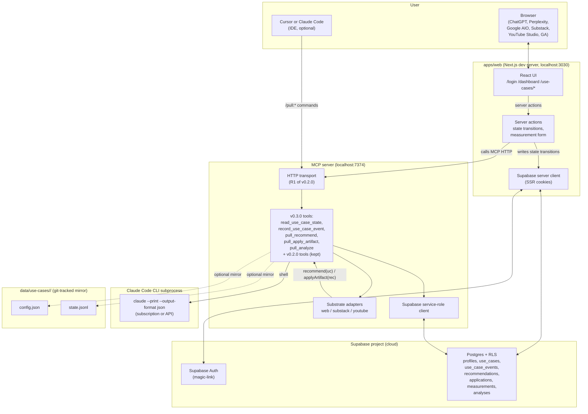
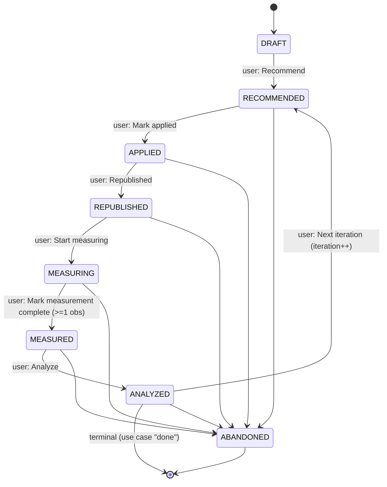
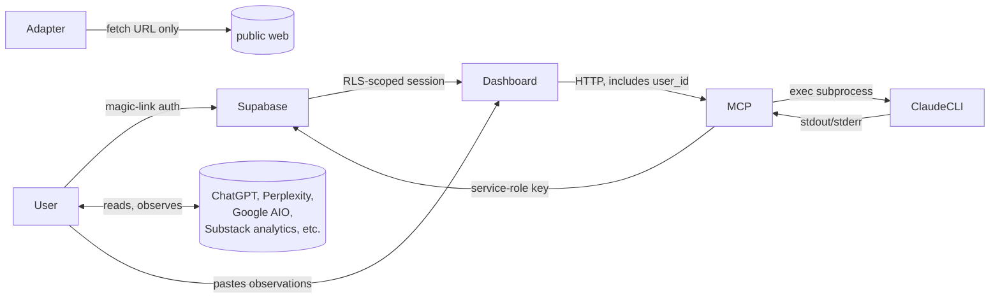

# llm-seo-lab v0.3.0 — Architecture

**Date:** 2026-04-26 · **Phase:** v0.3.0 R1 · **Status:** architecture freeze candidate · **Anchors:** [`prd.md`](prd.md), [`spec.md`](spec.md), [`migration.md`](migration.md), [`../spec/2026-04-25-llm-seo-lab-design.md`](../spec/2026-04-25-llm-seo-lab-design.md) (v0.2.0 architecture, frozen)

This document is the architectural counterpart to [`spec.md`](spec.md). The spec defines the surfaces; this document explains how the surfaces compose into a system, where each piece runs, what is in-process vs out-of-process, and how the per-use-case state machine is the single source of truth.

The v0.2.0 architecture diagram in [`../spec/2026-04-25-llm-seo-lab-design.md`](../spec/2026-04-25-llm-seo-lab-design.md) §4 is **frozen** as the architecture for the `/aeo:*` competitor-gap loop. v0.3.0 adds a parallel architecture for the `/pull:*` loop, which shares the MCP transport and Claude CLI seat with the v0.2.0 loop but introduces Supabase as a new persistent state layer.

---

## 1. System diagram (v0.3.0)

## 2. Process boundaries

| Process | Where it runs | Lifecycle |
|---|---|---|
| `apps/web` Next.js | local dev server on `localhost:3030` | started by `npm run dev` from `apps/web/` |
| MCP HTTP server | local Node process on `localhost:7374` | started by `bash plugin/scripts/aeo-mcp.sh start` (same as v0.2.0) |
| Claude CLI | subprocess of MCP, one per tool call | spawned and reaped per call |
| Supabase Postgres + Auth | Supabase Cloud project | always-on; user creates the project once |
| Plugin commands | invoked by Cursor or Claude Code | each command is a thin client of MCP HTTP |

**Why local-first.** Multi-tenant cloud hosting is v0.4.0. v0.3.0 runs entirely on the user's machine plus a single Supabase project — no separate API server, no separate worker pool, no queueing layer.

## 3. Data flow per stage transition

Every state transition follows the same shape:

1. User clicks an action button on `/use-cases/[id]` (or types `/pull:<verb>` in the IDE).
2. UI invokes a Next.js server action (or the plugin command sends an HTTP POST to MCP).
3. The server action validates the transition is legal given the use case's `current_stage` (the table in [`spec.md`](spec.md) §3.2).
4. The server action calls MCP via HTTP with the `use_case_id` and the desired verb.
5. MCP loads the full `UseCase` from Supabase via `read_use_case_state`.
6. For `Recommend` and `Analyze`: MCP shells out to Claude CLI, parses the result, falls open to a deterministic stub on failure, persists the result to Supabase, returns the persisted row(s).
7. For `Apply artifact`: MCP loads the recommendation, calls the substrate adapter's `applyArtifact`, returns the artifact to the dashboard. The dashboard does NOT persist `applications` until the user confirms they have applied the artifact (a second click).
8. For `Mark applied / Republished / Start measuring / Mark measurement complete / Next iteration / Abandon`: MCP just appends a `use_case_events` row and updates `use_cases.current_stage`.
9. The server action records the new `use_case_events` row (via MCP `record_use_case_event`) and returns control to the UI.
10. The UI revalidates and shows the new stage.

The dashboard never writes to `recommendations` or `analyses` directly. The MCP server never writes to `measurements` directly (the measurement form's server action does). This split is intentional: it keeps Claude-CLI-mediated writes on one side and human-input-mediated writes on the other.

## 4. Per-use-case state machine (operational view)

The state machine is enforced in three places:

- **UI**: only legal next-stage buttons are rendered. Illegal stages are not even reachable in the DOM.
- **Server actions**: each action validates `from_stage → to_stage` against the table before calling MCP.
- **MCP**: `record_use_case_event` rejects illegal transitions with `{ok:false, error:"illegal_transition"}`. This makes plugin commands enforce the same invariant as the UI.

## 5. Iteration semantics

Each cycle of `RECOMMENDED → … → ANALYZED` is one iteration. The iteration counter increments on the `ANALYZED → RECOMMENDED` transition. All rows produced during one cycle share the same `iteration` integer. The analyzer compares the current iteration's measurements with the prior iteration's measurements **on the same engines and prompts** when present; cells that don't match are reported as "no comparable A/B."

This is the within-use-case A/B substrate. There is no cross-use-case comparison and no cross-user benchmarking.

## 6. Substrate adapters (placement and lifecycle)

Adapters live in [`plugin/scripts/adapters/`](../../plugin/scripts/adapters/) and run inside the MCP process. Reasons for that placement:

- They need access to Claude CLI (recommendation generation invokes Claude, then post-processes).
- They need access to the v0.2.0 `open_pr` machinery (the `web` adapter reuses [`mcp/src/tools/index.ts`](../../mcp/src/tools/index.ts) `open_pr` for git-backed sites).
- Keeping them in the plugin directory means the plugin's `install.sh` ships them in lockstep with the commands that use them.

Adapters are **stateless**. They take a `UseCase` in and return `Recommendation[]` or an `Artifact` out. State persistence is the MCP tool's responsibility, not the adapter's.

## 7. Supabase access pattern

Two separate clients:

- **Dashboard SSR client** (`apps/web/lib/supabase/server.ts`): uses `@supabase/ssr` with the user's auth cookies. RLS applies; the user can only see their own rows.
- **MCP service-role client** (`mcp/src/clients/supabase.ts`): uses the service-role key. RLS does not apply. To prevent escalation, every MCP write that mentions a `user_id` cross-checks against the parent `use_cases.user_id` via a Postgres trigger; the trigger raises `EXCEPTION` if they disagree.

For local development the service-role key lives in `.env.local` (gitignored, generated by `supabase start` if the user wants to run a local Supabase instance, or copied from the Supabase project settings page).

## 8. Optional git-tracked mirror

For each use case, MCP optionally writes a JSONL mirror of stage events to `data/use-cases/<id>/state.jsonl` and a `config.json` snapshot of the use case's static fields. This is **off by default** and toggled by `LLM_SEO_LAB_GIT_MIRROR=1`. The mirror is useful for offline review and for the seed use cases in R7 (so the repo carries an audit trail of the live runs without depending on Supabase being up).

## 9. Coexistence with v0.2.0 `/aeo:*`

The v0.2.0 architecture is **not modified**. `/aeo:loop` against `data/sites/sharathsphd-githubio` still runs through the same MCP tools (`audit_page`, `generate_brief`, `open_pr`, `track_citations` (deprecated envelope), …). The two loops share:

- The same MCP HTTP transport.
- The same Claude CLI subprocess.
- The same Sākṣī / Sublation / Manas-Buddhi hooks (Pratyakṣa) — though the v0.3.0 charter ([`../triz/v0.3.0-pratyaksha-deltas.md`](../triz/v0.3.0-pratyaksha-deltas.md), produced in R2) refines what those hooks check for in citation-pull mode.

They do not share:

- State substrate (v0.2.0 uses git + `data/sites/`; v0.3.0 uses Supabase + optional `data/use-cases/`).
- Measurement substrate (v0.2.0 had Playwright stub + benchmark; v0.3.0 has user-reported observations only).

## 10. Trust boundary diagram

The user is the only entity that talks to AI engines and analytics platforms. The system never scrapes those surfaces.

## 11. Failure modes and fallbacks

| Failure | Detection | Fallback |
|---|---|---|
| Claude CLI exits non-zero | MCP catches subprocess error | Tool returns deterministic stub recommendation/analysis with `claude_run_id=null`, verdict `stub`, notes explaining why. State machine still advances. |
| Supabase unreachable from dashboard | server action throws | UI shows banner "Supabase offline; retry"; state does not advance |
| Supabase unreachable from MCP | tool throws | Tool returns `{ok:false, error:"db_unavailable"}`; dashboard surfaces the error and does not advance state |
| MCP unreachable from dashboard | fetch fails | UI shows banner; state does not advance |
| Substack/YouTube fetch failure | adapter throws | Recommendation falls open to a generic-knob set with explicit `notes:"could not fetch source"` |
| User submits malformed measurement | Zod schema rejects | Form re-renders with field-level error |
| User attempts illegal stage transition | server action and MCP both reject | UI never offered the button; if a plugin command is used, the command prints the rejection |

Every fallback path keeps the state machine consistent. There is no recovery code that "fixes" Supabase rows after the fact — every write goes through the same paths.
