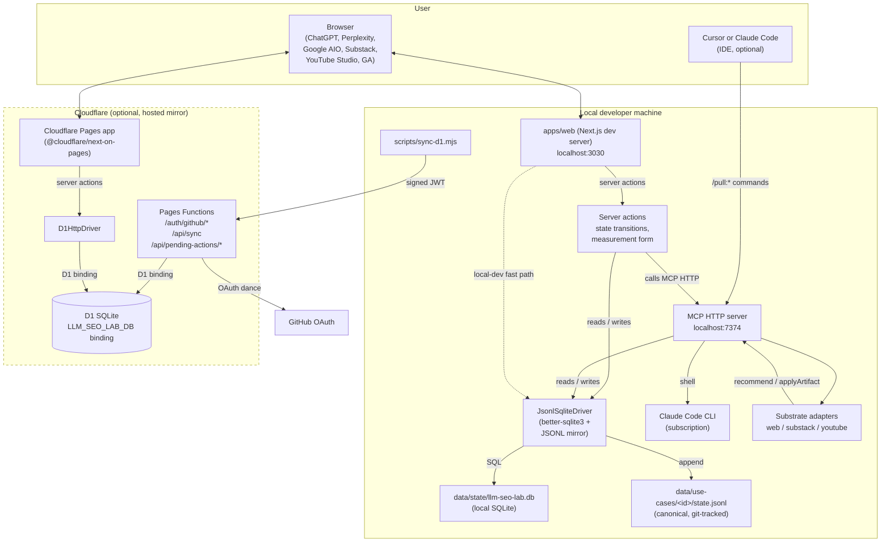
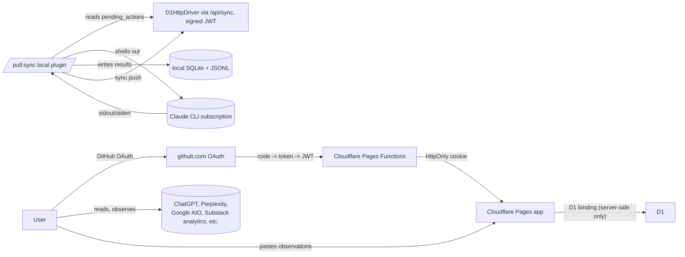

# llm-seo-lab v0.4.0 — Architecture

**Date:** 2026-04-26 · **Phase:** v0.4.0 R8.1 · **Status:** architecture freeze candidate · **Anchors:** [`prd.md`](prd.md), [`spec.md`](spec.md), [`migration.md`](migration.md), [`plan.md`](plan.md), [`../v0.3.0/architecture.md`](../v0.3.0/architecture.md) (frozen for reference)

This document is the architectural counterpart to [`spec.md`](spec.md). It explains how the v0.4.0 surfaces compose into a system, where each piece runs, and how the local Claude Code CLI continues to drive the inventive layer while the hosted dashboard becomes a thin intent-queue surface that any GitHub user can sign into.

The v0.3.0 architecture in [`../v0.3.0/architecture.md`](../v0.3.0/architecture.md) is **superseded** by this document. The v0.3.0 git tag preserves the historical Supabase + Vercel reference for anyone who needs to compare.

---

## 1. System diagram (v0.4.0)

**Key invariant.** `JsonlMirror` (the `data/use-cases/<id>/state.jsonl` files committed to the repo) is the **canonical** source of truth. Everything else — local SQLite, D1 — is a derivable cache. A fresh clone with `npm run import-jsonl` produces a fully-functional local SQLite. A fresh D1 with `npm run sync-d1` produces a fully-functional hosted mirror.

## 2. Process boundaries

| Process | Where it runs | Lifecycle |
|---|---|---|
| `apps/web` Next.js (local) | local dev server on `localhost:3030` | `npm run dev` from `apps/web/` |
| `apps/web` on Cloudflare Pages | Cloudflare Pages serverless | deployed via `wrangler pages deploy` or via the Cloudflare GitHub integration |
| `wrangler pages dev` (local emulation of Pages) | `localhost:8788` | `wrangler pages dev` from `apps/web/.vercel/output/static` after `npm run cf:build` |
| MCP HTTP server | local Node process on `localhost:7374` | `bash plugin/scripts/aeo-mcp.sh start` (unchanged from v0.2.0/v0.3.0) |
| Claude CLI | subprocess of MCP, one per tool call | spawned and reaped per call |
| GitHub OAuth | `https://github.com/login/oauth/*` | request-time only |
| D1 SQLite | Cloudflare-managed | always-on; user creates the database once via `wrangler d1 create` |
| Plugin commands | invoked by Cursor or Claude Code | each command is a thin client of MCP HTTP, with `/pull:sync` additionally reading D1 |

**Why local-first stays primary.** The Claude Code CLI runs on the developer's machine on their own subscription. The hosted dashboard is a *secondary* surface that lets the same user (or a coauthor sharing the GitHub identity) drive the loop from a browser without standing up a local dev environment. The hosted surface enqueues; the local plugin executes.

## 3. Data flow per stage transition (LOCAL path)

Identical to [v0.3.0 architecture §3](../v0.3.0/architecture.md#3-data-flow-per-stage-transition) except:

- Step 4 (server action calls MCP) goes through `StateDriver` instead of Supabase.
- Step 5 (MCP loads `UseCase`) reads from `StateDriver`.
- Step 6 (MCP persists results) writes through `StateDriver`, which mirrors to JSONL.

Auth is GitHub OAuth (or local-dev shim); the rest of the flow is unchanged.

## 4. Data flow per stage transition (HOSTED path)

When the user clicks an action button on the **hosted Cloudflare Pages** dashboard:

1. The browser POSTs to a Next.js server action running inside `next-on-pages`.
2. The server action validates the legality of the transition against the table in [`../v0.3.0/spec.md`](../v0.3.0/spec.md) §3.2.
3. The server action calls `StateDriver.enqueuePendingAction(...)` against `D1HttpDriver`. **It does not call MCP, and it does not invoke Claude CLI.**
4. The dashboard revalidates and the use case shows a "queued" badge.
5. The user (or any signed-in coauthor) opens Cursor/Claude Code on a machine where the plugin is installed and the local MCP is running, and runs `/pull:sync`.
6. `/pull:sync` calls MCP `read_pending_actions` (which goes through the local `JsonlSqliteDriver` *or* the `D1HttpDriver` depending on `LLM_SEO_LAB_D1=1`).
7. For each pending row, `/pull:sync` dispatches to `/pull:recommend|apply|analyze|state`, which call MCP tools that go through `StateDriver` to persist results.
8. `/pull:sync` calls MCP `mark_action_executed` to flip the row to `status='executed'`.
9. If the user used D1 in step 6, the next dashboard revalidation reads the new state from D1 and the badge becomes "executed".

The hosted dashboard never speaks to Claude CLI. The local plugin always does.

## 5. Per-use-case state machine (operational view)

Identical to [v0.3.0 architecture §4](../v0.3.0/architecture.md#4-per-use-case-state-machine-operational-view). The state machine is enforced in three places, exactly as in v0.3.0:

- **UI**: only legal next-stage buttons are rendered.
- **Server actions**: each validates `from_stage → to_stage` against the table.
- **`StateDriver`**: every `updateUseCaseStage` call rejects illegal transitions with `IllegalTransitionError`.

The plugin command flow checks the same invariant via MCP `record_use_case_event` (now backed by `StateDriver`).

## 6. Iteration semantics

Unchanged from v0.3.0.

## 7. Substrate adapters

Unchanged from v0.3.0. They live in [`plugin/scripts/adapters/`](../../plugin/scripts/adapters/) and run inside the MCP process. They never speak to a database; they take a `UseCase` in and return `Recommendation[]` or an `Artifact` out.

## 8. State access pattern

Two drivers, one interface:

- **Local `JsonlSqliteDriver`** ([`packages/state/src/drivers/jsonl-sqlite.ts`](../../packages/state/src/drivers/jsonl-sqlite.ts)): file-backed SQLite + JSONL mirror. Used by:
  - The local Next.js dev server (when `LLM_SEO_LAB_AUTH=local` or when `LLM_SEO_LAB_D1` is unset).
  - The MCP HTTP server (always — MCP runs locally).
  - The plugin commands (transitively, through MCP).
- **Hosted `D1HttpDriver`** ([`packages/state/src/drivers/d1-http.ts`](../../packages/state/src/drivers/d1-http.ts)): wraps the Cloudflare D1 binding. Used by:
  - The Cloudflare Pages app's server actions.
  - The Pages Functions under `apps/web/functions/`.
  - Optionally, the local plugin's `/pull:sync` command (via `LLM_SEO_LAB_D1_REMOTE=1`).

**Use-case ownership invariant.** Both drivers reject any write to a child table (`recommendations`, `applications`, `measurements`, `analyses`, `use_case_events`, `pending_actions`) where `row.user_id !== use_cases.user_id` for the parent `use_case_id`. This replaces the v0.3.0 Postgres trigger.

## 9. Sync between local and D1

`scripts/sync-d1.mjs` is the canonical pipe for getting local state up to D1. Flow:

1. Read all rows from local SQLite (`use_cases`, `use_case_events`, `recommendations`, `applications`, `measurements`, `analyses`, `pending_actions`).
2. POST to `https://<deployment>.pages.dev/api/sync` with the bundle in the body, an `Authorization: Bearer <jwt>` header signed with `SESSION_JWT_SECRET`, and `?since=<iso>` if doing an incremental sync.
3. The Pages Function at `apps/web/functions/api/sync.ts` verifies the JWT, then runs `INSERT OR REPLACE` on D1 for each row in a transaction, rejecting any row whose ownership invariant fails.
4. Return a per-row apply log so the local script can update its `data/state/.last-sync` marker.

This is the only place where the JWT is used as something other than a session cookie. The v0.4.0 design intentionally uses the same secret for both: the JWT is the user's GitHub identity, signed by the deployment, and the `/api/sync` endpoint accepts it to mean "this push is on behalf of this GitHub user".

D1 → local sync is in `scripts/import-d1.mjs` and is the recovery path for "I lost my local SQLite, give me back my state". It hits a `GET /api/export` Pages Function that streams a full bundle for the signed-in user.

## 10. Trust boundary diagram

The hosted dashboard never holds a Claude session. The local plugin never holds a GitHub OAuth session (it uses a long-lived service JWT signed by the same secret to talk to `/api/sync`). The user is the only entity that talks to AI engines.

## 11. Failure modes and fallbacks

| Failure | Detection | Fallback |
|---|---|---|
| Claude CLI exits non-zero | MCP catches subprocess error | Tool returns deterministic stub recommendation/analysis with `claude_run_id=null`, verdict `stub`. State machine still advances. |
| Local SQLite unreadable | driver throws | UI banner "local state corrupt; run `npm run import-jsonl`"; state does not advance |
| D1 unreachable from Pages app | `D1HttpDriver` throws | UI banner "D1 offline; retry"; state does not advance |
| `/api/sync` JWT verification fails | Pages Function returns 401 | local sync script logs the failure and exits non-zero; user re-authenticates |
| GitHub OAuth fails | `/auth/github/callback` returns 4xx | redirect to `/login` with `?error=oauth_failed`; user retries |
| Pending action dispatched but `/pull:sync` later fails | `mark_action_executed` writes `status='failed'` with the error | UI surfaces the error; user can retry or cancel |
| User submits malformed measurement | Zod schema rejects | Form re-renders with field-level error |
| User attempts illegal stage transition | server action and `StateDriver` both reject | UI never offered the button; if a plugin command is used, it prints the rejection |
| `data/use-cases/<id>/state.jsonl` and SQLite drift | first read after detection writes a `STATE_DRIFT` event row | Document the recovery path in `migration.md` §recovery |

Every fallback path keeps the state machine consistent. There is no recovery code that "fixes" rows after the fact — every write goes through the same `StateDriver` paths.
