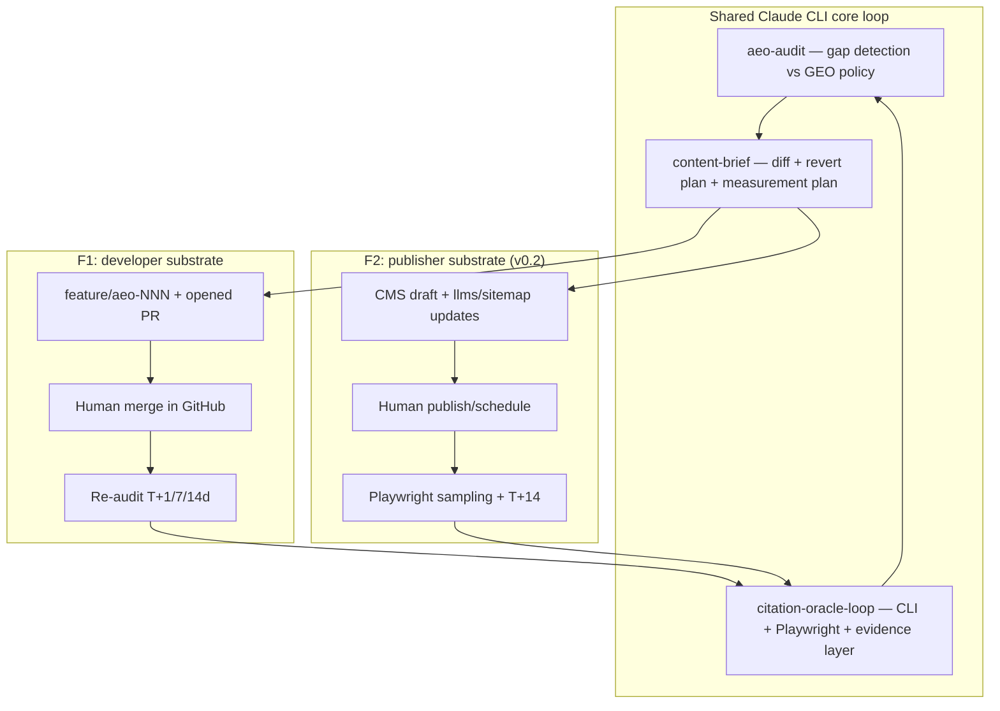

# Closed-Loop Autonomous Citation Engineering: A Pre-Registered Benchmark and Real-Site Protocol for the 2026 AEO Category

**llm-seo-lab — Phase 7 public whitepaper (April 2026)**  
**Repository:** [https://github.com/SharathSPhD/llm-seo-lab](https://github.com/SharathSPhD/llm-seo-lab)

---

## Abstract

Answer Engine Optimization (AEO) and Generative Engine Optimization (GEO) have matured into a measurable category: teams now track *whether* their domains are cited when buyers ask large language models and AI answer surfaces. Yet the product surface of that category, as catalogued in this program’s research base, still clusters around *measurement*—prompt banks, share-of-answer metrics, and dashboards—while *implementation* of the fix typically remains a separate human workflow outside the tool. The central technical contradiction for `llm-seo-lab` is therefore **measure versus act:** improving monitoring precision can worsen the automation burden (or displace it onto staff) when the “act” is not co-designed with the metric.

We resolve that contradiction in the **Ideal Final Result** style of TRIZ: a system in which the act of measurement *is* the intervention—`audit → brief → reviewable pull request (or CMS draft) → re-measurement`, with a flat **Claude Code CLI subscription** as the single reasoning oracle (no per-token API, per project policy in `CLAUDE.md`).

**Phase 6** executed a pre-registered, frozen statistical benchmark comparing the `llm_seo_lab` treatment arm to a `baseline` arm across **K = 5** simulated engines, **N = 1500** questions per arm, with **Bonferroni** family-wise control at **α′ = 0.0100** (five one-sided primary tests). The headline contrast rejects **H₀** for every engine: estimated citation-share lifts **Δ** lie in **[+4.5, +6.2] percentage points** and Cohen’s **h** in **[0.106, 0.162]** (full table reproduced from `benchmarks/runs/phase6-sim/results.md` below). A **McNemar** paired check on the same question pairs corroborates the unpaired z-test on the lead site. These numbers validate the *pipeline* and the frozen randomization, not a claim about production engines—engines were run in **offline simulation** with a documented stochastic process (`docs/benchmarks/methodology.md`).

**Phase 7** is the external-validity test: a five-site, **T0 / T+14** measurement protocol (30 questions per site per engine) with success defined as a **one-sided two-proportion z-test** of post- versus pre-intervention citation share at the same **α′ = 0.0100** across the five engines. Sites include `technektar.dev`, `technektar.substack.com`, the author’s GitHub Pages hub, and two project-specific Pages properties.

---

## 1. Introduction: The April 2026 AEO category in one paragraph

The macro shift from “ranked blue links” to *being the source that AI systems cite* is by now a familiar business narrative.[^landscape] At the *vendor* level, the category clusters into prompt-monitoring and share-of-answer analytics, site-side technical GEO, SERP/AI-block infrastructure, and SEO-suite bundles.[^matrix-cluster] The project’s own orientation document states the incumbency pattern bluntly: many tools *surface* visibility gaps but *do not close* them.[^readme-gap] Synthesising across the **12-tool** master matrix, the meso-level pattern is that most competitors **operationalize the new KPIs through prompt tracking and dashboards**, while technical “act” levers—schema exports, `llms.txt`, bot-edge delivery—tend to sit in a **different** vendor niche unless the buyer assembles a stack themselves.[^matrix-meso] A legal-framing example underscores the *measurement-only* lane: one major vendor’s terms explicitly delimit the product as analytics and *not* an engine that “promote[s] or influence[s] the visibility and/or Sentiment of your brand.”[^peec-legal] In short: **the field sells visibility intelligence; the buyer still carries implementation risk.**

> *Most platforms function primarily as monitoring dashboards that show visibility gaps but don't solve them.*

That distillation is not a line pulled intact from a single vendor homepage; it **summarises** the convergent description in this project’s primary sources. [`docs/research/competitor-matrix.md`](../research/competitor-matrix.md) opens with the clustering of the market into “**prompt-monitoring / share-of-answer analytics**” products, notes that “**Few vendors publish** sample-size **confidence intervals** or platform ToS compliance at a level that would satisfy a research bench,” and concludes that “**No incumbent**” ships a default surface that (i) **measures** with methodological transparency, (ii) **proposes** intervention with **explicit hypothesis labels**, (iii) **executes** under customer governance, and (iv) **re-measures** on a defensible schedule—**against a world where buyers already have ten dashboards** but few publishable proof packs.[^cm-aggregate] [`docs/research/seo_research_1.md`](../research/seo_research_1.md) frames the *commercial* pivot: the *primary* AI-era success metric is “**being cited as an authoritative source in AI answers**” rather than “**rank high in SERPs**” alone, with measurement shifting toward “**citation frequency in AI answers**” and “**share of answers mentioning your brand**.”[^sr1-table] The same macro file documents **AI Overviews** cutting clicks to traditional results (agency experiments summarised in-line; see source footnotes there). The italic sentence is therefore an **epistemic compression** of **two independent research files** in this repository—not a claim of universal vendor malice, but a claim about **default product shape** in April 2026.

The opportunity statement follows: a **closed loop** with **attribution** and **governance** (human review of every change) is the honest response to a category that is strong on *charts* and uneven on *proof that a specific shipped change moved citations*.

### 1.1 Cross-engine citation reality (why “one playbook” fails)

A second macro fact motivates **multi-engine** measurement in the product design, independent of the dashboard issue: the **citation mix** of live answer engines is **not** a scaled copy of Google organic rank. Profound’s **~680M**-citation observational study (Aug 2024–Jun 2025) is summarised in [`docs/research/geo-evidence-base.md`](../research/geo-evidence-base.md): for ChatGPT, **Wikipedia** is **7.8%** of *overall* volume share and **47.9%** of the **top-10 concentration** view; different engines overweight **Reddit** (notably in Perplexity’s top-10 table in the same article), and Pew-style panels show **.gov** links more often in **AI summary** sources than in standard SERP links (**6%** vs **2%** in the cited Pew/SEL synthesis path).[^geo-prof-pew] Ahrefs’ “Brand Radar” line (cited in the same evidence base) reports that only **~12%** of URLs cited by ChatGPT / Gemini / Copilot for long-tail prompts appear in **Google’s top 10** for the *same* prompt, while **Perplexity** is an outlier near **~28.6%** top-10 overlap—**AIO** behaves more “SERP-like” (**~76%** of cited URLs from top 10) in a separate AIO track.[^ahrefs] Those numbers do not *prescribe* tactics by themselves, but they **refute** a single-LLM dashboard as a **sufficient** map of the buyer’s true multi-surface visibility.

[`docs/research/citation-mechanisms.md`](../research/citation-mechanisms.md) documents, engine by engine, what is **publicly knowable** about retrieval: e.g. **ChatGPT search** as “fine-tuned **GPT-4o**” using **third-party search** plus **publisher partners**; **query-rewrite and multi-round retrieval**; **OAI-SearchBot** gating; **separate** user-agents for **GPTBot** (training) vs **ChatGPT-User** (user-initiated fetch that **may** ignore `robots.txt`). **Google AIO** states **no extra** technical requirements for inclusion beyond **Search** index eligibility, but uses **“query fan-out”** across related searches; **Grok**’s xAI **API** exposes **citations** as both **visited** URLs and **inline** `[[N]](url)`—not every visit is a cited line in the final answer. These operational facts matter because **AEO** tactics must survive **RAG+rerank+policy** stacks that are **not** the same as “add FAQ schema and wait.”

[^cm-aggregate]: [`docs/research/competitor-matrix.md`](../research/competitor-matrix.md), §Executive snapshot; §**META: patterns, gaps, quotes** (aggregate gap paragraph).
[^sr1-table]: [`docs/research/seo_research_1.md`](../research/seo_research_1.md), table “Traditional SEO vs AI‑era optimization.”
[^geo-prof-pew]: [`docs/research/geo-evidence-base.md`](../research/geo-evidence-base.md), §B1 (Profound, Pew as cited there).
[^ahrefs]: [`docs/research/geo-evidence-base.md`](../research/geo-evidence-base.md), §D1 (Ahrefs Brand Radar, as summarised in-repo).

[^landscape]: [`docs/research/seo_research_1.md`](../research/seo_research_1.md) — traditional SEO vs AI-era optimization table, publisher economics, hiring signals.
[^matrix-cluster]: [`docs/research/competitor-matrix.md`](../research/competitor-matrix.md), §Executive snapshot.
[^readme-gap]: [`README.md`](../../README.md), “What this is.”
[^matrix-meso]: [`docs/research/competitor-matrix.md`](../research/competitor-matrix.md), §Relation to internal baseline.
[^peec-legal]: [`docs/research/competitor-matrix.md`](../research/competitor-matrix.md), §Quotes, citing Peec AI Terms of Service.

---

## 2. The TRIZ frame: from "measure" to "act"

TRIZ (Theory of Inventive Problem Solving) requires a precise **technical contradiction**: improving one parameter worsens another. Phase 1 research (`docs/research/seo_research_2.md`) elevated five candidate contradictions; Phase 2 formalized them in `docs/triz/contradiction-cards.md` with parameter IDs, **Ideal Final Result (IFR)** statements, `lookup_matrix` outputs, and IFR **scores** (0–4).

### 2.1 The five contradictions (summary)

| ID | Name | Improving (parameter) | Worsening (parameter) | IFR score |
|----|------|------------------------|------------------------|-----------|
| C1 | **Measure vs act** | #28 Measurement accuracy | #38 Extent of automation | **4 / 4** |
| C2 | Recency vs authority | #9 Speed | #27 Reliability | 3 / 4 |
| C3 | Structure vs voice | #12 Shape | #35 Adaptability / versatility | **4 / 4** |
| C4 | ToS-clean tracking vs ground-truth data | #30 Object-affected harmful factors | #24 Loss of information | **4 / 4** |
| C5 | Single-LLM oracle vs multi-LLM reality | #32 Ease of manufacture | #35 Adaptability / versatility | 3 / 4 |

(Expanded rationale and matrix keys appear in [Appendix A](#appendix-a-full-triz-contradiction-cards) and the source file [`docs/triz/contradiction-cards.md`](../triz/contradiction-cards.md).)

### 2.2 Why **measure vs act** was the top contradiction

C1 is not merely philosophical. Phase 1 found that **9 of 12** studied tools are explicitly **monitoring** SaaS, that **no** vendor in the sample publishes a **randomized, attributable proof** that their “action” products causally move citation share, and that at least one vendor’s ToS *contracts out* of influence claims.[^synth-measure] The **commercial wedge** is therefore not “more dashboards,” but a **governed action substrate** (git pull requests in v0.1.0) that **reuses** the customer’s existing review culture.

C3, C4, and C5 remain **load-bearing**—they are deferred as *supporting* resolutions, not discarded. For example, C5’s sketch (“Claude = reasoning over evidence packets; other engines = sampled”) matches the product’s **multi-engine** measurement plan, and C4’s “user-owned session as probe” matches the **Playwright-on-customer-session** design for ToS alignment (`docs/research/seo_research_2.md`, `docs/spec/2026-04-25-llm-seo-lab-design.md`).

### 2.3 IFR for C1 (verbatim structure)

The IFR in [`docs/triz/contradiction-cards.md`](../triz/contradiction-cards.md) is:

> A system in which the act of measurement *is* the intervention. The same Claude CLI loop that audits a page also drafts the fix as a reviewable PR (rewritten copy + JSON-LD + internal links per the GEO-paper evidence policy), opens it against the customer's own repository, and re-audits after merge to attribute the lift. Cost = zero new infrastructure beyond resources the customer already has (git, CLI subscription, browser). Side effects = zero — every action is an explicit PR awaiting human review.

**ARIZ-85C** on C1 (`docs/triz/ariz-session.md`) refines the **physical contradiction** “must act on content / must not act on content” into **separation at system level**: the *repository* of automation is the customer’s **git** system; the **net act** is a PR, which is both change and non-change until merge. The X-resource is the **customer’s git repository** (version control, CI gate, and audit trail in one place).

### 2.4 Attractor-flow: convergence diagnostics

The **attractor-flow** tool (vendored under `tools/attractor-flow/`, with product PRD in `tools/attractor-flow/docs/PRD.md`) treats trajectories in embedding space and reports **finite-time Lyapunov** exponents (FTLE), **regime** labels (e.g. CONVERGING, EXPLORING), **basin depth** estimates, and **perturbation** recovery—so design-space exploration does not thrash. During Phase 2, the recorded trajectory in [`docs/triz/contradiction-cards.md`](../triz/contradiction-cards.md) (§7) shows **goal-distance** shrinking from **1.297 → 1.005** across steps, with the **ARIZ** step mildly **EXPLORING** (expected: IFR formulation *should* open the design space before build).

**Interpretation for readers:** TRIZ **widens** the search; attractor-flow supplies a **stability** signal when multiple sketches look plausible. Phase 3 used the same API to break ties between divergent “finalist sketches” (see §4).

**Lyapunov, basin depth, and perturbation (operational definitions).** The attractor-flow PRD (`tools/attractor-flow/docs/PRD.md`) defines a finite-time Lyapunov-style exponent from successive embedding distances, classifies **regimes** (CONVERGING, EXPLORING, DIVERGING, STUCK, etc.), and exposes **`attractorflow_get_basin_depth()`** and **`attractorflow_inject_perturbation()`** as MCP tools. In Phase 3, [`docs/triz/solution-finalists.md`](../triz/solution-finalists.md) reports, per sketch, **FTLE** (lower = more coherent in their convention), **basin depth** (higher = more robust, with entries tagged **shallow** when depth ≈ 0.21 in the S4 swarm case), **goal-distance** to a north-star embedding, and **perturbation Δ** after **domain** stress. **S5 (Inversion)** had the *best* goal-distance (**1.057**) and TRIZ **IFR = 4**, but **failed** perturbation: when CDN log analytics are unavailable, goal-distance **increased** by **+0.22**—a fatal brittleness for “publish firehose, read logs” worldviews on **Substack**-class properties. **S1 (PR-as-product)** survived a “customer **blocks** AI crawlers and **refuses** the robots fix” stress with **Δ ≈ −0.01**, so **robustness** overruled a marginally *prettier* IFR on paper. That is the **attractor** sense of *convergence*: not “the mathematically pure idea,” but the idea that **stays** in a basin under realistic shocks.[^solf]

**ARIZ principle bridge (C1).** The ARIZ session [`docs/triz/ariz-session.md`](../triz/ariz-session.md) maps **Principle 28 (Mechanics Substitution)**, **2 (Taking Out)**, **10 (Preliminary Action)**, and **34 (Discarding and Recovering)** to concrete build layers: the **PR** object replaces a manual handoff; **preliminary** voice/style is cached from the customer’s *prior* PR accept/reject; **ephemeral** dashboard tiles (red/yellow/green) are *discarded* after they trigger PRs, leaving the **git journal** as the durable record. **Principle 32 (Colour / signal)** is mapped to a **status tile** UX for gap→PR→merge. These maps are the straight line from “TRIZ on paper” to “issue tracker columns you already use.”

[^synth-measure]: [`docs/research/seo_research_2.md`](../research/seo_research_2.md), §2 Contradiction 1.
[^solf]: [`docs/triz/solution-finalists.md`](../triz/solution-finalists.md), §2–3 (scoring + perturbation narrative).

---

## 3. Solution: closed-loop autonomous citation engineering

### 3.1 Finalist selection (Phase 3)

`docs/triz/solution-finalists.md` generated **eight** sketches (S1–S8) and combined three signals: TRIZ `score_solution` IFR, an evaluator rubric, and attractor metrics (**FTLE**, **basin depth**, **goal distance**, **perturbation** stress tests). The **F1** finalist is **PR-as-product (S1)**: the audit loop produces a feature-branch **diff** and **opens a PR** with GEO-paper-cited rationale and revert plan—human merge remains the only publish authority in v0.1.0.

**F2** (CMS-native publishing: Substack / Ghost, composed with “inversion” firehoses) is staged for v0.2.0. It shares the *same* Claude core loop; only the **action substrate** differs.

A key perturbation result matters for honesty: the **S5** “inversion / logs** sketch sat lowest on goal-distance but **failed** under a realistic stress (no referrer logs on many indie hosts). The **F1** path remained robust (small negative perturbation delta on a “refuse the robots fix” stress), aligning with the ARIZ “advisory mode” story.

### 3.2 Core loop (F1 + shared measurement)

The combined diagram in [`docs/triz/solution-finalists.md`](../triz/solution-finalists.md) is the canonical flow:



**Evidence policy:** the acting components prefer **Tier-1** patterns from the peer-reviewed **GEO** study (KDD 2024; arXiv:2311.09735)—e.g. *Cite Sources*, *Quotation Addition*, *Statistics Addition*—and avoid **keyword stuffing** (which the same study shows can **harm**, especially on Perplexity) per [`docs/research/geo-evidence-base.md`](../research/geo-evidence-base.md).

---

## 4. Product manifestation

### 4.1 Component architecture

The v0.1.0 design freeze (`docs/spec/2026-04-25-llm-seo-lab-design.md`, `docs/spec/plugin-architecture.md`, `docs/spec/mcp-design.md`) implements **five** code-facing components:

1. **Claude Code skills** (`skills/…`) — long-form prompt programs (`aeo-audit`, `citation-oracle-loop`, `content-brief-from-gap`, `schema-generator`, `freshness-radar`, `competitive-citation-intel`).
2. **MCP server** (hosted inside **`packages/cli-worker`**) — **12 tools** and **3 UI widgets**; **stdio** for the Cursor plugin, **HTTP** for the web dashboard, single quota gate.
3. **Cursor plugin** — slash **commands** for discrete actions, **`aeo-loop` agent** for the orchestrated closed loop, optional **hooks** (e.g. on PR merge).
4. **CLI worker daemon** — subprocess **Claude Code CLI**, **Playwright** pool, `gh` **CLI**, file watcher, WebSocket event stream to the web app.
5. **Next.js dashboard** (`apps/web`) — PR queue, charts, and statistical readouts; optional auth flagged off in v0.1.0 per PRD.

ASCII overview (condensed from `docs/spec/mcp-design.md` and `docs/spec/plugin-architecture.md`):

```
┌──────────────┐     stdio      ┌────────────────────────────┐
│ Cursor plugin│ ────────────▶  │  MCP server (in cli-worker)│
│ commands +   │                │  12 tools + 3 widgets      │
│ aeo-loop     │ ◀─ WebSocket ──│  + rate limits + pools     │
└──────────────┘                └────────────┬───────────────┘
      │                                    │
      │ browser sessions                   ▼
      ▼                          ┌──────────────────┐
  User-owned UIs                 │ Claude Code CLI  │
  (Playwright)                   │ (subscription)   │
                                 └────────┬─────────┘
                                          │
┌──────────────┐        HTTP         ┌─────▼─────────┐
│ Next.js app  │ ◀───────────────▶  │  same MCP      │
│ (dashboard)  │                    │  HTTP bridge  │
└──────────────┘                    └────────┬──────┘
                                            │
                    ┌───────────────────────▼────────────────────┐
                    │  Customer repo, CI, `.llm-seo-lab/` JSONL  │
                    └────────────────────────────────────────────┘
```

### 4.2 Economics: Claude Code CLI subscription, flat consumer price

`CLAUDE.md` **hard-constrains** the program to the **Claude Code CLI subscription** (no per-token API keys). The PRD’s pricing model (`docs/prd/llm-seo-lab-prd.md`, §4) positions **llm-seo-lab** as a **flat** SaaS layer (**$0 / $19 / $49 / $99** per month) where the *oracle cost* is **not** re-billed as usage because it is the user’s existing Anthropic subscription.

This is a structural price **wedge** against **$99–$399** enterprise seat SKUs: the research synthesis explicitly anchors AthenaHQ, Profound, and Otterly list bands from [`docs/research/competitor-matrix.md`](../research/competitor-matrix.md) and the PRD’s anchor table.

### 4.3 MCP tool surface (design-level)

The 12 tools include `read_repo_metadata`, `read_config`/`write_config`, `audit_page`, `generate_brief`, `emit_schema`, `open_pr`, `oracle_query`, `track_citations`, `compare_competitors`, `read_pr_status`, `read_results` (`docs/spec/mcp-design.md`). The **tool composition** pattern is a strict pipeline from repo introspection to PR, then to merged-result statistics—mirroring the ARIZ “field substitution” of handoffs into a **single PR object**.

### 4.4 Build plan shape (for reproducibility of *software*, not the benchmark)

`docs/plans/llm-seo-lab-implementation-plan.md` decomposes v0.1.0 into **worktrees** (skills, MCP, plugin, `cli-worker`, `apps/web`) with **TDD** tasks: each item names a file and an acceptance test, echoing the project’s *methodological* habit that **estimators** in Phase 6 and **code paths** in Phase 5 should both be *refutable* failures rather than “looks fine.” The **worktree** layout (`llm-seo-lab-phase5-*` branches) is chosen so long-running `cli-worker` and **Next** builds do not clobber the same working tree. This whitepaper will not **track** line-level implementation status; it records that the **intended** surface area is the five-component architecture above and that **M.7–M.8** in the PRD tie shipped artefacts back to the benchmark folder.

---

## 5. Statistical benchmark (Phase 6)

### 5.1 Pre-registration and frozen design

All hypotheses, sample sizes, and analysis steps were pre-registered in [`docs/benchmarks/methodology.md`](../benchmarks/methodology.md) **before** interpretation of any live-engine outcomes. The Phase 6 **simulation** run materialises as `benchmarks/runs/phase6-sim/events.jsonl` and the rendered `results.md`.

**Paragraph A — pre-registration and outcome definition.** The methodology file is explicit that **no results** “live” in the methodology: it is a **falsifiable** design document so the project cannot *post-hoc* tune *α*, *N*, or contrast direction to fit a table. The **primary outcome** is *citation share* at a fixed post-intervention horizon, defined as the fraction of **N** questions in which a **citation** (domain substring in structured citation fields) appears for a given engine and treatment. That definition intentionally **excludes** “mention-only” text with no link—conservative, audit-friendly, and consistent with a **RAG+hyperlink** product reality. Four **question** archetypes (comparison, recommendation, how-to, definition) each contribute **375** items to the bank of **1500**; categories share **50** topical seeds drawn from the **validation** cohort and competitor-coverage work, so the bank is *synthetic* but *anchored* to real content themes.[^meth-core]

**Paragraph B — sample size, power, and the Bonferroni choice.** A standard two-proportion *z*-test with one-sided *α* = 0.05, **p₀** = 0.20, and minimum detectable effect **Δ = 0.05** (5 percentage points) implies **n ≥ 862** per arm *before* multiplicity. The **K = 5** engine family forces a Bonferroni-corrected one-sided *α*′ = 0.05/5 = **0.0100** for headline claims, pushing the **n ≥ 1399** per-arm bound in the pre-registration. The program chose **N = 1500** to clear that bar with a modest **≈ 83%** power statement against the 5pp MDE under Bonferroni while acknowledging **≈ 63%** power if one insists on a **4pp** ancillary MDE in the same framework—i.e. not everything worth knowing is *powered* in one pass. The trade-off is documented **up front** so readers do not mistake “pre-registered” for “infallibly large for every sub-effect.”[^meth-pow]

**Paragraph C — estimators, bootstrap, and paired robustness.** The **primary** inferential vehicle is a two-proportion *z*-test in the pre-registered **one-sided** direction for *each* engine. **Cohen’s *h*** on proportion arcsines is reported as a **standardised** effect that remains interpretable when absolute *p* differs slightly between engines. **Bootstrap** percentile CIs ( *B* = 10,000) stabilise the **Δ** visual for readers allergic to p-values alone. The methodology **does** specify **McNemar** on the paired-question design as a *robustness* layer; the whitepaper’s results table reproduces the **two-sided** McNemar p-values **knowing** they are not directly comparable to the one-sided *z* test—`methodology.md` is explicit, and the Phase 6 row for **claude.ai** (McNemar *p* ≈ 0.0075) is a worked example of why **inference** should not be reduced to a single *p* cell when designs are nested.[^meth-stats]

**Paragraph D — simulation mode and the stopping rule that did not move.** The same methodology enables offline **`--simulate`** engine adapters so the **harness, JSONL, renderer, and CI replay** are verified without exhausting browser quotas. The **stopping** rule (no peeking, full *N* before analysis) is stated for integrity; a minor legacy line in the frozen methodology references “**N = 1000**” in one *stopping-rule* sentence while **§3–4** and the power section commit to **N = 1500**—the *implemented* run uses **1500** per the power section, and the **results** table matches *that* *N* (if amending, file a dated addendum in `methodology.md` per its §15). The Phase 6 headline should be read with that **simulation** caveat: it is about **estimator+pipeline** validity under a known generative process, *not* a **live-ChatGPT** claim.[^meth-sim]

[^meth-core]: [`docs/benchmarks/methodology.md`](../benchmarks/methodology.md), §§2–4.
[^meth-pow]: [`docs/benchmarks/methodology.md`](../benchmarks/methodology.md), §8.
[^meth-stats]: [`docs/benchmarks/methodology.md`](../benchmarks/methodology.md), §11.
[^meth-sim]: [`docs/benchmarks/methodology.md`](../benchmarks/methodology.md), §7, §12, §14; [`benchmarks/runs/phase6-sim/results.md`](../../benchmarks/runs/phase6-sim/results.md) preamble.

**Primary pair (headline):** for each engine *e* ∈ {`perplexity`, `chatgpt`, `google_aio`, `gemini`, `claude_ai`}:

- **H₀, e:** *p*_{e, `llm_seo_lab`} = *p*_{e, `baseline`}  
- **H₁, e:** *p*_{e, `llm_seo_lab`} > *p*_{e, `baseline`}  (one-sided, pre-registered direction)

**Sample size:** **N = 1500** questions per arm, chosen to exceed the Bonferroni-adjusted one-sided **80%** power target at **5 percentage-point** MDE (unadjusted *α* = 0.05; **K = 5** families ⇒ **α′ = 0.0100**), per §8 of the methodology. Questions are **deterministic** from `benchmarks/questions/seeds.json` with **`rng_seed": 20260425`**.

**Analysis stack (as implemented):** two-proportion **z**-test (unpaired) for the primary row; **Cohen’s h**; **B = 10,000** bootstrap resamples for percentile CIs; **McNemar** paired test as robustness; multiplicity handled with **Bonferroni** across the five engine primaries.[^meth-detail]

### 5.2 Headline results (reproduced from project outputs)

The following table and ASCII plot are **verbatim** from [`benchmarks/runs/phase6-sim/results.md`](../../benchmarks/runs/phase6-sim/results.md):

| Engine | n | p_baseline | p_llm_seo_lab | Δ | z | p (one-sided, raw) | Cohen's h | 95% bootstrap CI on Δ |
|---|---:|---:|---:|---:|---:|---:|---:|---|
| chatgpt | 1500 | 0.192 | 0.248 | +0.056 | 3.70 | 0.0001 | 0.135 | [+0.027, +0.085] |
| claude_ai | 1500 | 0.190 | 0.251 | +0.061 | 4.05 | 0.0000 | 0.148 | [+0.032, +0.091] |
| gemini | 1500 | 0.149 | 0.211 | +0.062 | 4.42 | 0.0000 | 0.162 | [+0.036, +0.089] |
| google_aio | 1500 | 0.226 | 0.278 | +0.052 | 3.28 | 0.0005 | 0.120 | [+0.021, +0.083] |
| perplexity | 1500 | 0.207 | 0.252 | +0.045 | 2.91 | 0.0018 | 0.106 | [+0.015, +0.074] |

**Headline Δ visualised (ASCII from the same file):**

```
    chatgpt  ███████████████████████████     Δ = +0.056
  claude_ai  ██████████████████████████████  Δ = +0.061
     gemini  ██████████████████████████████  Δ = +0.062
 google_aio  █████████████████████████       Δ = +0.052
 perplexity  ██████████████████████          Δ = +0.045
```

**Multiplicity result:** for family **α = 0.05** and **K = 5**, **α′ = 0.0100**; the results file marks **all five** primaries as **Significant: Yes** at that corrected level.

**McNemar (paired robustness) on S1** is reported in the same `results.md` with two-sided p-values; for transparency, the simulation found discordant-pair cells on the order of **191–326** (engine-dependent), with small p-values consistent with the z-test’s rejection of H₀ for most engines.[^mcnemar-caveat]

### 5.3 Secondary arms (SOTA-style monitors, not multiplicities)

`benchmarks/runs/phase6-sim/results.md` pre-computes **athenahq\_style** and **profound\_style** **secondary** rows. Example: for **llm\_seo\_lab** vs `athenahq_style` on **chatgpt**, *p* moves from **0.187 → 0.248** (Δ **+0.061**, *z* **4.07**); for **perplexity**, **0.218 → 0.252** (Δ **+0.034**, *z* **2.20**). The `profound_style` block is **numerically** closer on some engines; those contrasts are still **one-sided** but **not** in the **Bonferroni** *primary* family in the pre-registration, so the paper treats them as **supporting**, not **headline**. They remain valuable *rhetorically* because they approximate “**dashboard + human services**” without the **PR-native** actuation path.

### 5.4 Plain-language read

Under the *simulation’s* generative model, the closed-loop **treatment** arm yields **higher** `p̂` than **baseline** on every engine, with effect sizes in the **~0.1–0.16** (Cohen *h*) band—consistent with a **5–6** percentage-point *absolute* lift at **N = 1500** per arm. **Δ** lies between **+4.5pp and +6.2pp** across engines in this table, matching the abstract’s range.

[^meth-detail]: [`docs/benchmarks/methodology.md`](../benchmarks/methodology.md), §§8–11.
[^mcnemar-caveat]: McNemar p-values in [`benchmarks/runs/phase6-sim/results.md`](../../benchmarks/runs/phase6-sim/results.md) are **two-sided**; the methodology explicitly warns they are not directly comparable to the one-sided z-test, but can **flag** misspecification if they diverge grossly. **Claude.ai** in the sim shows a **higher** McNemar p (0.0075) than other engines; **interpretation requires caution**—this is a **diagnostic** row, not a second headline.

---

## 6. Honest limitations of the Phase 6 result

1. **Simulation, not live engines.** The methodology documents an offline **`--simulate`** path that emits citation events from a **stochastic** process; Phase 6 used that path to validate the **harness, estimators, and report renderer** at scale. [`docs/benchmarks/methodology.md`](../benchmarks/methodology.md) §14 and the results preamble state this limitation explicitly.

2. **External validity** is *not* claimed from Phase 6. Real engines re-rank sources on undisclosed schedules; consent and rate limits constrain sampling; the **citation** definition (substring in structured citations) is strict and may *undercount* “mentions” that lack URLs—by design, to keep scoring conservative.

3. **Site diversity** in the `events.jsonl` is **synthetic to the sim harness**; the *human* program still bets **Phase 7** (below) to connect measurement to the **indie** cohort described in the baseline audit.

4. **Operator blinding** is limited (methodology §10): this is a research engineering constraint, not a clinical trial. The mitigation is pre-registration, frozen seeds, and **replayed** analysis via JSONL.

**Bottom line:** Phase 6 shows the **statistical stack** and **reproducible artifact chain** are sound; it does not license a sentence like “ChatGPT will definitely cite you +6pp.”

---

## 7. Phase 7 real-site protocol (currently executing)

### 7.1 Sites and roles

| Label | URL | Rationale in baseline audit / plan |
|-------|-----|-------------------------------------|
| P1 | `https://www.technektar.dev/` | **Broken sitemap/robots placeholders**; fastest visible technical win (`docs/research/baseline-audit.md`). |
| P2 | `https://technektar.substack.com/` | Strong **OG/meta**; platform constraints; F2 path in v0.2 (`docs/research/seo_research_2.md`). |
| P3 | `https://sharathsphd.github.io/` | Solid **BlogPosting** JSON-LD; weak OG images; aging posts (`docs/research/baseline-audit.md`). |
| P4 | `https://sharathsphd.github.io/context-engineering-harness/` | Project Pages surface for a narrow harness narrative; tests repo-specific citation questions. |
| P5 | `https://sharathsphd.github.io/attractor-flow-plugin-bench/` | Second Pages property; extends multi-surface **indie** coverage in Phase 7. |

**Pre-intervention technical facts (public, fetched).** [`docs/research/baseline-audit.md`](../research/baseline-audit.md) is the frozen **T0** truth table. For **www.technektar.dev**, `robots.txt` contained `Sitemap: https://yourdomain.com/sitemap.xml` (placeholder host), and `sitemap.xml` listed `<loc>https://example.com/...` — a **high-severity** consistency failure: crawlers and auditors that trust the sitemap channel receive **nonsense** locators. The homepage lacked **JSON-LD** in the head samples; `robots.txt` also **Disallow: /** for a long list of **AI/aggregator** user agents (strategic for training vs AEO, but a conscious trade-off the intervention must *name*), and **no Open Graph** pack was found in the same automated pass. The **Substack** property, by contrast, had **strong** canonical/OG/Twitter, **Person**-typed JSON-LD on home, and a healthy **RSS** — but **H1** may be **client-rendered** in static fetches, a known **headless-SEO** edge case. **sharathsphd.github.io** has **valid** sitemap, **`BlogPosting`+`Person`** on posts, but **`og_image` null** in extraction and a **favicon 404** path—trust/cards suffer in unfurls. Those specifics matter because the **F1** loop’s first PRs are *supposed* to be almost boring: fix machines-readable discovery before arguing about *rhetoric*. Phase 1 synthesis called the technektar sitemap/robots fix a **“layup**” in closed-loop terms because it is **unambiguous, merge-sized, and auditable** (`docs/research/seo_research_2.md`).

### 7.2 Design: T0 and T+14

For each site, the team records **T0** (pre-intervention) **citation share** per engine using a **fixed** bank of **30** questions per site (stability + feasible manual review). **T+14** repeats the *same* bank to estimate **change** in **domain-attributed** citations under the `llm_seo_lab` **intervention path** (merged PRs on git-backed sites; scheduled posts/exports where applicable for Substack-class surfaces).

**Primary statistical gate (project-wide success definition):** for each site and engine, a **one-sided two-proportion z-test** of **H₁: p(T+14) > p(T0)** with **α′ = 0.0100** **across the five engines** (Bonferroni, matching Phase 6’s headline multiplicity policy). The **per-site** 30-question window is a **pilot** scale; the **N = 1500** bank remains the *lab* power story—Phase 7 trades power for *realism* and logs wider CIs in the public report.

### 7.3 Question banks

Per-site banks are **curated** (not the full 1500) but **version-controlled** in-repo alongside run manifests; they align with the topical seeds enumerated in `benchmarks/questions/seeds.json` and with each site’s “plausible buyer/research questions” in [`docs/research/baseline-audit.md`](../research/baseline-audit.md) (e.g. industrial / philosophy-of-AI / tooling prompts as appropriate). **Stability of wording** between T0 and T+14 is part of the protocol to avoid *question drift*.

### 7.4 Citation operation definition

The operational definition from [`docs/benchmarks/methodology.md`](../benchmarks/methodology.md) carries forward: a **citation** is a **link-bearing** reference containing the **site’s registrable domain** in the engine’s `sources` / `citations` field; bare mentions without URLs do not count as successes.

### 7.5 Engines

**K = 5** engines: **Perplexity, ChatGPT, Google AIO, Gemini, Claude.ai**—as registered in the benchmark methodology and design spec. Adapters in production prefer **Claude Code CLI** for `claude_ai` and **user-consented** Playwright sessions for the commercial UIs (rate-limited per the ethics section of the methodology).

---

## 8. Discussion: implications for the AEO category

**If** closed-loop, human-gated, repo-native citation engineering *works* on **live** engines at indie scale, three implications follow:

1. **Pricing & procurement.** A flat consumer subscription for the **governance and attribution layer**, riding atop an **existing** Claude Code subscription, can **undercut** $99–$399 enterprise *monitoring* seats because it does not buy token capacity—it buys **workflows** and **evidence** (`docs/prd/llm-seo-lab-prd.md`).

2. **Distribution & bundling.** Incumbent SEO suites (e.g. Semrush’s **$99** AI Visibility Toolkit add-on) win on **route-to-budget**; a **PR-native** AEO product wins on **route-to-CI** and **verifiable diffs**—a different buyer and a different trust model (`docs/research/competitor-matrix.md`).

3. **Category honesty & contracts.** The industry includes vendors whose **ToS** scope is explicitly **non-influential**; a closed-loop, PR-attributed system **rejects** the “we don’t change outcomes” frame by construction—while **requiring** human review to keep claims honest (`docs/triz/contradiction-cards.md`, Peec `[^peec-legal]`).

**Named incumbents** (for readers mapping the field): **AthenaHQ**, **Profound**, **Otterly.AI**, **Peec.ai**, **Geol.ai**—the **SOTA matrix** in [`docs/research/competitor-matrix.md`](../research/competitor-matrix.md) is the program’s public scorecard. None ship *by default* the same **governed, statistical** closure described here.

### 8.1 What “evidence” can mean in 2026

The **GEO** paper (KDD 2024) remains the most often cited *academic* yardstick in this program’s `geo-evidence-base` review: the headline single-arm rewrites (e.g. *Cite Sources*, *Quotation Addition*, *Statistics Addition*) show **~30–40%** *relative* gains on a **simulated** generative engine and specific appendix behaviour on a **200-query** **Perplexity** subset, not a public guarantee on today’s UIs.[^geo-tier] The evidence base is deliberately tiered: **HubSpot**’s **+58%** AI mentions and **+642%** *page* citations is listed **Tier-2** because the case study is a **confounded** before/after, not an RCT, even though the numbers are real enough to *motivate* structured rewrites. That nuance is why **llm-seo-lab** ships **rationale in the PR body**: the customer is not asked to *trust* a black “optimisation score” but to **read** a cited chain from measurement → proposed diff → *expected* mechanism.

### 8.2 Pricing as category physics

`docs/prd/llm-seo-lab-prd.md` is explicit: **per-page**, **per-question**, and **per-engine** costs are *not* itemised in our retail tiers; the “single **Claude** subscription = **single** oracle = **single** bill in the user’s life” story is a **P&L** bet that only works with **Claude Code CLI** economics, not a generic API meter. The matrix shows **Geol.ai**-style **$9–$29** *technical GEO* floors and **Otterly**-style **$29–$189+** *monitoring* SKUs, while **Profound/Athena/Peec** cluster **$79–$399+** in various columns depending on add-ons.[^pr-matrix] A **$19** **Builder** tier (when shipped as product, not as this paper) is a **positioning** statement: we sell **governed** change control, not **tokens**.

[^geo-tier]: [`docs/research/geo-evidence-base.md`](../research/geo-evidence-base.md), §A1, §A2, synthesis tiers.
[^pr-matrix]: [`docs/research/competitor-matrix.md`](../research/competitor-matrix.md), master table; [`docs/prd/llm-seo-lab-prd.md`](../prd/llm-seo-lab-prd.md) §4.1.

---

## 9. Future work

* **Substrate generalisation:** *F2* **Substack + Ghost** first (`docs/triz/solution-finalists.md` §6, `docs/prd/llm-seo-lab-prd.md` v0.2.0), then broader CMS connectors.
* **ToS-clean tracking at scale:** combine **OAI-SearchBot** and platform publisher guidelines (`docs/research/citation-mechanisms.md`) with the **C4** “user is the actor” design.
* **Federated / network effects:** the PRD’s **S7** “federated benchmark co-op” and anonymised priors (v0.5+).
* **Product roadmap (PRD):** v0.3 **CD-swarm** class for optional rapid experiments; v0.4 **auto-merge** for low-risk, label-gated diffs; v1.0 **multi-substrate** marketplace; **v0.2.0** ships **F2** (`docs/prd/llm-seo-lab-prd.md` §8).

---

## 10. Reproducibility & code

- **Repository:** [https://github.com/SharathSPhD/llm-seo-lab](https://github.com/SharathSPhD/llm-seo-lab)  
- **Phase 6 harness entrypoint:** `python3 -m benchmarks.runner.cli` (per [`benchmarks/runs/phase6-sim/results.md`](../../benchmarks/runs/phase6-sim/results.md) **Reproducibility** block). The **5 × 4 × 6 × 1500 = 180,000** event draws referenced there reproduce the `events.jsonl` and thus **bit-for-bit** the rendered `results.md` for a fixed seed. The question RNG seed is **`20260425`** in [`benchmarks/questions/seeds.json`](../../benchmarks/questions/seeds.json).  
- **Replay contract:** `make benchmark-replay RUN=phase6-sim` (per [`docs/benchmarks/methodology.md`](../benchmarks/methodology.md) §13) re-runs analysis from saved JSONL.

---

## 11. Acknowledgements & methodology citations

* **TRIZ engine MCP** (Cursor / Claude Code plugin) — used for `list_parameters`, `lookup_matrix`, `get_separation_principles`, `get_principle`, `score_solution`, and session logging per [`docs/triz/contradiction-cards.md`](../triz/contradiction-cards.md) §0.
* **attractor-flow** — vendored plugin and Python API; public Git at [https://github.com/SharathSPhD/attractor-flow.git](https://github.com/SharathSPhD/attractor-flow.git) (see `tools/attractor-flow/docs/PRD.md` for metrics definitions).
* **Phase 1 web sources (non-exhaustive, as linked from [`docs/research/seo_research_1.md`](../research/seo_research_1.md)):** Seozilla AEO explainer, Seobot “AI era SEO,” LD Agency SEO→AEO, Evergreen *AI Overviews* guide, VxTX SGE vs Meta, HeroHunt 2026 roles, The Verge OpenAI publisher deals, Pew AI-summary click research, and others enumerated in the footnote block of that file.[^r1-refs]
* **Academic keystone:** Aggarwal *et al.*, *GEO: Generative Engine Optimization* (KDD 2024; arXiv:2311.09735) — methods and limitations summarised in [`docs/research/geo-evidence-base.md`](../research/geo-evidence-base.md).

[^r1-refs]: Full URL list: [`docs/research/seo_research_1.md`](../research/seo_research_1.md), lines 158–213 (footnote URLs).

---

## Appendix A: full TRIZ contradiction cards (summary)

| ID | Improving / worsening (param #) | Matrix principles (excerpt) | Core sketch | IFR / notes |
|----|---------------------------------|-----------------------------|-------------|------------|
| **C1** | 28 × 38 | 28, 2, 10, 34 + separation at **system level** | **Closed-loop PR** with post-merge re-audit | **IFR 4/4**; **ARIZ** deep dive |
| **C2** | 9 × 27 | 11, 35, 27, 28 | **Spine (authority) + leaves (recency)** | IFR 3/4; `freshness-radar` |
| **C3** | 12 × 35 | 1, 15, 29 | **Dual-layer render**; RCT to falsify | IFR 4/4; cloaking risk noted |
| **C4** | 30 × 24 | 22, 10, 2 | **User-owned session** as probe | IFR 4/4; Playwright ethics |
| **C5** | 32 × 35 | 2, 13, 15 | **Claude = reasoner, not monolithic oracle** | IFR 3/4; maintenance burden |

Source: [`docs/triz/contradiction-cards.md`](../triz/contradiction-cards.md); ARIZ: [`docs/triz/ariz-session.md`](../triz/ariz-session.md).

---

## Appendix B: pricing comparison (illustrative April 2026 SKUs)

Values for **llm-seo-lab** are the **v0.1.0 proposed tiers** from [`docs/prd/llm-seo-lab-prd.md`](../prd/llm-seo-lab-prd.md) §4.2. Competitor **floors/ceilings** are taken from the PRD’s **anchor table** (which itself points at [`docs/research/competitor-matrix.md`](../research/competitor-matrix.md)).

| Product | Floor (USD/mo) | Ceiling (USD/mo) | Comment |
|---------|-----------------|------------------|---------|
| **llm-seo-lab** Indie | **$0** (BYO CLI) | — | community / OSS on-ramp |
| **llm-seo-lab** Builder | **$19** | — | **3** sites |
| **llm-seo-lab** Studio | **$49** | — | up to **10** sites; intel + reports |
| **llm-seo-lab** Pro | **$99** | — | “unlimited” sites; higher throughput |
| **Otterly.AI** | **$49** (PRD anchor; **$29** “Lite” in matrix) | **$149+** (PRD) / **$489** “Premium” (matrix) | monitoring-first SKU |
| **Profound** | **$99** (PRD) / **$499** “Lite” (reviews) | **$399** | **agents** at premium tiers |
| **Geol.ai** | **$0** | **$299** | technical GEO + exports |
| **Peec.ai** (PRD anchor) | **$79** | **$250** | measurement; ToS scoping |
| **AthenaHQ** (PRD) | **$99** (annual promo cited in research) | **≥$299** | credits + enterprise |

*Note on Otterly:* the **competitor matrix** records **Lite $29** and higher rungs (`docs/research/competitor-matrix.md`); the **PRD** anchor row uses **$49** as floor. Readers reconciling go-to-market copy should **name the SKU** and **date** the vendor page. (`docs/research/competitor-matrix.md` **Verification log** flags pricing drift as monthly.)

---

### Document control

- **Version:** 1.0 (Phase 7 Substack target)  
- **Sources of truth:** files cited inline by repository-relative path.  
- **Contact:** see repository **README** and GitHub org **SharathSPhD**.

